# Thiết Kế Giao Thức Tầng Ứng Dụng

> **Application Layer Protocol Design**
> English Learning Application
> Phiên bản: 1.0

---

## Mục Lục

1. [Tổng Quan Giao Thức](#1-tổng-quan-giao-thức)
2. [Thiết Kế Bản Tin](#2-thiết-kế-bản-tin)
3. [State Machine](#3-state-machine)
4. [Xử Lý Bản Tin](#4-xử-lý-bản-tin)
5. [Ví Dụ Minh Họa](#5-ví-dụ-minh-họa)

---

## 1. Tổng Quan Giao Thức

### 1.1. Đặc Điểm Giao Thức

| Thuộc tính | Giá trị |
|------------|---------|
| **Tầng vận chuyển** | TCP |
| **Port mặc định** | 8888 |
| **Định dạng dữ liệu** | JSON |
| **Encoding** | UTF-8 |
| **Mô hình** | Request-Response + Push Notification |
| **Trạng thái** | Stateful (có session) |

### 1.2. Kiến Trúc Giao Thức

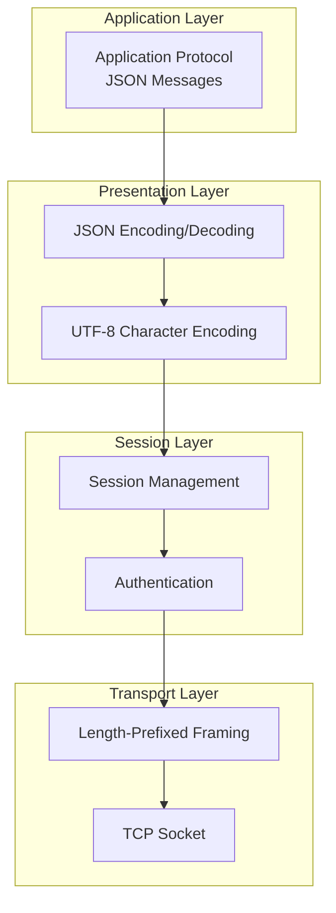
```mermaid
graph TB
    subgraph "Application Layer"
        APP[Application Protocol<br/>JSON Messages]
    end

    subgraph "Presentation Layer"
        JSON[JSON Encoding/Decoding]
        UTF8[UTF-8 Character Encoding]
    end

    subgraph "Session Layer"
        SESS[Session Management]
        AUTH[Authentication]
    end

    subgraph "Transport Layer"
        TCP[TCP Socket]
        LEN[Length-Prefixed Framing]
    end

    APP --> JSON
    JSON --> UTF8
    UTF8 --> SESS
    SESS --> AUTH
    AUTH --> LEN
    LEN --> TCP
```

### 1.3. Message Framing

Mỗi message được đóng gói với **Length-Prefix Protocol**:

```
+----------------+------------------+
| Length (4 bytes) | JSON Payload     |
| Network Order    | UTF-8 Encoded    |
+----------------+------------------+
```

```cpp
// Gửi message
uint32_t length = htonl(message.length());
send(socket, &length, sizeof(length), 0);
send(socket, message.c_str(), message.length(), 0);

// Nhận message
uint32_t length;
recv(socket, &length, sizeof(length), 0);
length = ntohl(length);
char* buffer = new char[length + 1];
recv(socket, buffer, length, 0);
```

---

## 2. Thiết Kế Bản Tin

### 2.1. Cấu Trúc Bản Tin Tổng Quát

```json
{
    "messageType": "MESSAGE_TYPE",
    "messageId": "unique_identifier",
    "timestamp": 1704067200000,
    "sessionToken": "authentication_token",
    "payload": {
        // Dữ liệu cụ thể cho từng loại message
    }
}
```

### 2.2. Mô Tả Các Trường

| Trường | Kiểu | Bắt buộc | Mô tả |
|--------|------|:--------:|-------|
| `messageType` | string | ✓ | Định danh loại bản tin |
| `messageId` | string | ✗ | ID duy nhất để tracking |
| `timestamp` | int64 | ✗ | Unix timestamp (milliseconds) |
| `sessionToken` | string | ✗ | Token xác thực phiên |
| `payload` | object | ✓ | Dữ liệu chi tiết |

### 2.3. Phân Loại Bản Tin

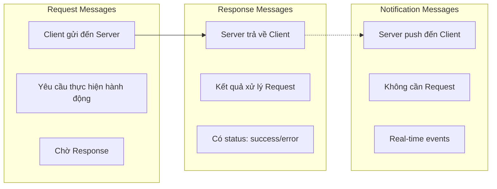
```mermaid
graph LR
    subgraph "Request Messages"
        direction TB
        R1[Client gửi đến Server]
        R2[Yêu cầu thực hiện hành động]
        R3[Chờ Response]
    end

    subgraph "Response Messages"
        direction TB
        P1[Server trả về Client]
        P2[Kết quả xử lý Request]
        P3[Có status: success/error]
    end

    subgraph "Notification Messages"
        direction TB
        N1[Server push đến Client]
        N2[Không cần Request]
        N3[Real-time events]
    end

    R1 --> P1
    P1 -.-> N1
```

### 2.4. Danh Sách Bản Tin Chi Tiết

#### 2.4.1. Authentication Messages

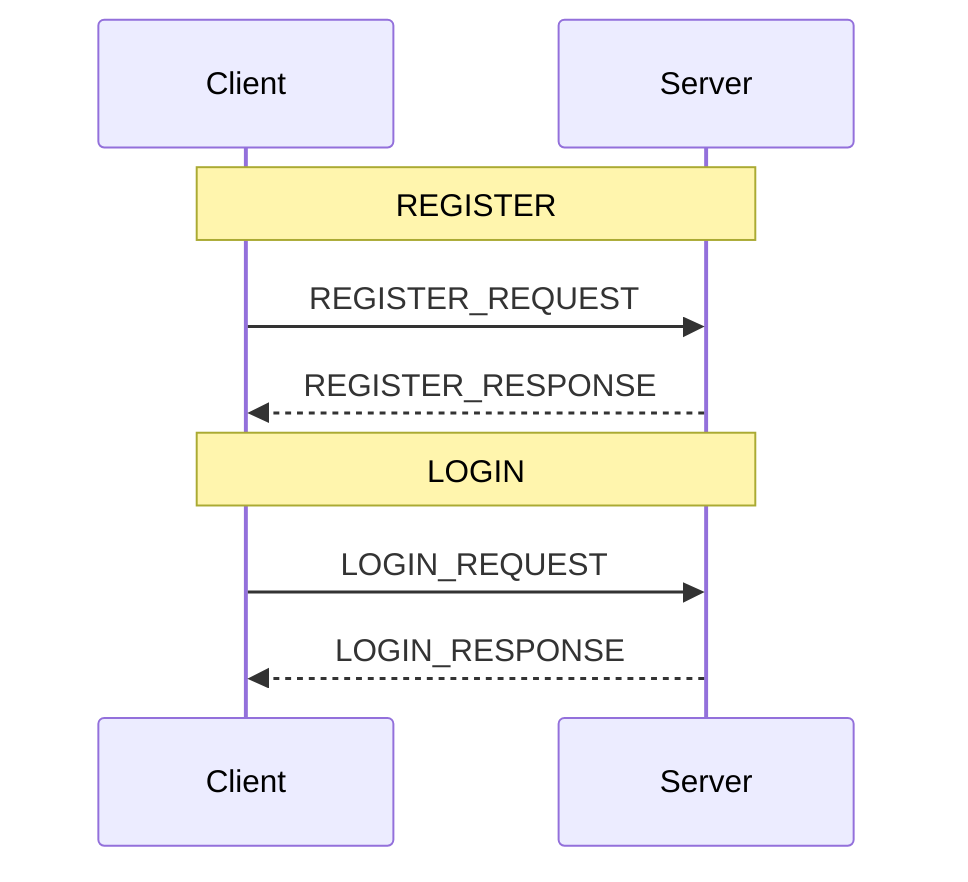
```mermaid
sequenceDiagram
    participant C as Client
    participant S as Server

    Note over C,S: REGISTER
    C->>S: REGISTER_REQUEST
    S-->>C: REGISTER_RESPONSE

    Note over C,S: LOGIN
    C->>S: LOGIN_REQUEST
    S-->>C: LOGIN_RESPONSE
```

##### REGISTER_REQUEST

| Trường | Kiểu | Mô tả |
|--------|------|-------|
| `payload.fullname` | string | Họ tên người dùng |
| `payload.email` | string | Email đăng ký |
| `payload.password` | string | Mật khẩu |
| `payload.confirmPassword` | string | Xác nhận mật khẩu |

```json
{
    "messageType": "REGISTER_REQUEST",
    "payload": {
        "fullname": "Nguyen Van A",
        "email": "nguyenvana@example.com",
        "password": "securePassword123",
        "confirmPassword": "securePassword123"
    }
}
```

##### REGISTER_RESPONSE

| Trường | Kiểu | Mô tả |
|--------|------|-------|
| `payload.status` | string | "success" hoặc "error" |
| `payload.message` | string | Thông báo kết quả |
| `payload.data.userId` | string | ID người dùng (nếu success) |

```json
{
    "messageType": "REGISTER_RESPONSE",
    "messageId": "msg_001",
    "timestamp": 1704067200000,
    "payload": {
        "status": "success",
        "message": "Registration successful",
        "data": {
            "userId": "user_abc123"
        }
    }
}
```

##### LOGIN_REQUEST

| Trường | Kiểu | Mô tả |
|--------|------|-------|
| `payload.email` | string | Email đăng nhập |
| `payload.password` | string | Mật khẩu |

```json
{
    "messageType": "LOGIN_REQUEST",
    "payload": {
        "email": "student@example.com",
        "password": "password123"
    }
}
```

##### LOGIN_RESPONSE

| Trường | Kiểu | Mô tả |
|--------|------|-------|
| `payload.status` | string | "success" hoặc "error" |
| `payload.data.userId` | string | ID người dùng |
| `payload.data.fullname` | string | Họ tên |
| `payload.data.email` | string | Email |
| `payload.data.level` | string | Cấp độ: beginner/intermediate/advanced |
| `payload.data.role` | string | Vai trò: student/teacher/admin |
| `payload.data.sessionToken` | string | Token phiên làm việc |
| `payload.data.expiresAt` | int64 | Thời điểm hết hạn |

```json
{
    "messageType": "LOGIN_RESPONSE",
    "messageId": "msg_002",
    "timestamp": 1704067200000,
    "payload": {
        "status": "success",
        "message": "Login successfully",
        "data": {
            "userId": "user_001",
            "fullname": "Nguyen Van A",
            "email": "student@example.com",
            "level": "beginner",
            "role": "student",
            "sessionToken": "token_xyz789",
            "expiresAt": 1704070800000
        }
    }
}
```

---

#### 2.4.2. Lesson Messages

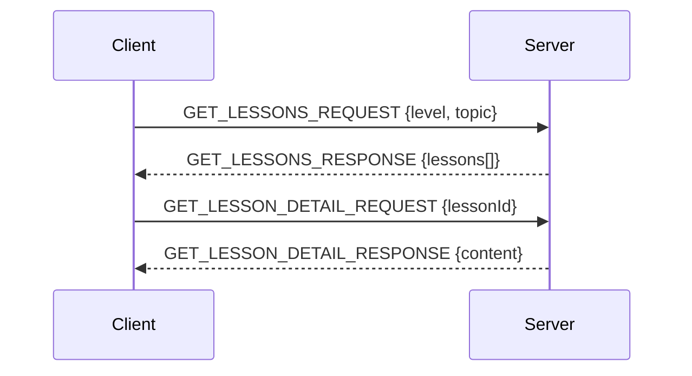
```mermaid
sequenceDiagram
    participant C as Client
    participant S as Server

    C->>S: GET_LESSONS_REQUEST {level, topic}
    S-->>C: GET_LESSONS_RESPONSE {lessons[]}

    C->>S: GET_LESSON_DETAIL_REQUEST {lessonId}
    S-->>C: GET_LESSON_DETAIL_RESPONSE {content}
```

##### GET_LESSONS_REQUEST

```json
{
    "messageType": "GET_LESSONS_REQUEST",
    "sessionToken": "token_xyz789",
    "payload": {
        "level": "beginner",
        "topic": "grammar"
    }
}
```

##### GET_LESSONS_RESPONSE

```json
{
    "messageType": "GET_LESSONS_RESPONSE",
    "payload": {
        "status": "success",
        "data": {
            "total": 2,
            "lessons": [
                {
                    "lessonId": "lesson_001",
                    "title": "Basic Grammar",
                    "topic": "grammar",
                    "level": "beginner",
                    "description": "Learn basic English grammar"
                },
                {
                    "lessonId": "lesson_002",
                    "title": "Present Tense",
                    "topic": "grammar",
                    "level": "beginner",
                    "description": "Understanding present tense"
                }
            ]
        }
    }
}
```

##### GET_LESSON_DETAIL_REQUEST

```json
{
    "messageType": "GET_LESSON_DETAIL_REQUEST",
    "sessionToken": "token_xyz789",
    "payload": {
        "lessonId": "lesson_001"
    }
}
```

##### GET_LESSON_DETAIL_RESPONSE

```json
{
    "messageType": "GET_LESSON_DETAIL_RESPONSE",
    "payload": {
        "status": "success",
        "data": {
            "lessonId": "lesson_001",
            "title": "Basic Grammar",
            "description": "Learn basic English grammar",
            "level": "beginner",
            "topic": "grammar",
            "textContent": "# Introduction to Grammar\n\nGrammar is the system...",
            "videoUrl": "https://example.com/video.mp4",
            "audioUrl": "https://example.com/audio.mp3"
        }
    }
}
```

---

#### 2.4.3. Test Messages

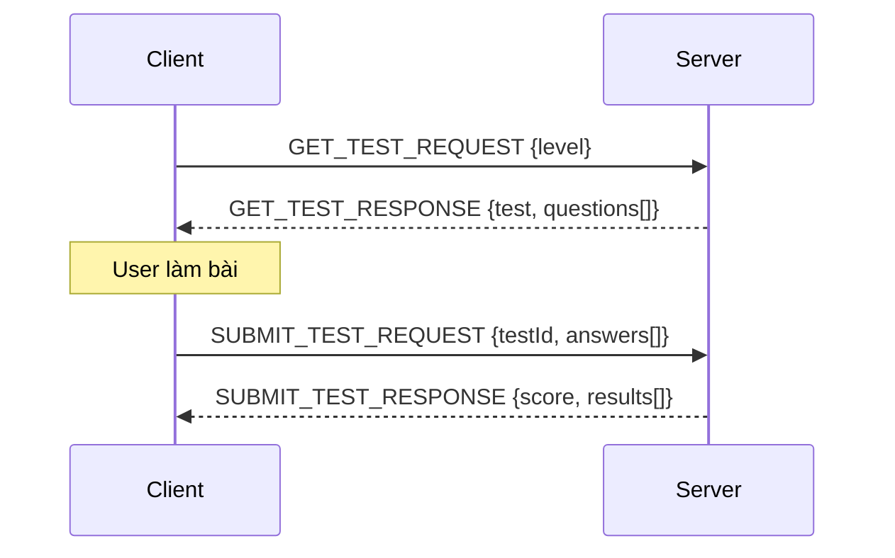
```mermaid
sequenceDiagram
    participant C as Client
    participant S as Server

    C->>S: GET_TEST_REQUEST {level}
    S-->>C: GET_TEST_RESPONSE {test, questions[]}

    Note over C: User làm bài

    C->>S: SUBMIT_TEST_REQUEST {testId, answers[]}
    S-->>C: SUBMIT_TEST_RESPONSE {score, results[]}
```

##### GET_TEST_REQUEST

```json
{
    "messageType": "GET_TEST_REQUEST",
    "sessionToken": "token_xyz789",
    "payload": {
        "level": "beginner"
    }
}
```

##### GET_TEST_RESPONSE

```json
{
    "messageType": "GET_TEST_RESPONSE",
    "payload": {
        "status": "success",
        "data": {
            "testId": "test_001",
            "title": "Beginner English Test",
            "timeLimit": 1800,
            "totalPoints": 100,
            "questions": [
                {
                    "questionId": "q1",
                    "type": "multiple_choice",
                    "question": "What is 'apple' in Vietnamese?",
                    "points": 10,
                    "options": [
                        {"id": "a", "text": "Quả cam"},
                        {"id": "b", "text": "Quả táo"},
                        {"id": "c", "text": "Quả chuối"},
                        {"id": "d", "text": "Quả nho"}
                    ]
                },
                {
                    "questionId": "q2",
                    "type": "fill_blank",
                    "question": "She ___ a student.",
                    "points": 10
                },
                {
                    "questionId": "q3",
                    "type": "sentence_order",
                    "question": "Arrange the words",
                    "points": 15,
                    "words": ["is", "a", "This", "book"]
                }
            ]
        }
    }
}
```

##### SUBMIT_TEST_REQUEST

```json
{
    "messageType": "SUBMIT_TEST_REQUEST",
    "sessionToken": "token_xyz789",
    "payload": {
        "testId": "test_001",
        "answers": [
            {"questionId": "q1", "answer": "b"},
            {"questionId": "q2", "answer": "is"},
            {"questionId": "q3", "answer": "This is a book"}
        ]
    }
}
```

##### SUBMIT_TEST_RESPONSE

```json
{
    "messageType": "SUBMIT_TEST_RESPONSE",
    "payload": {
        "status": "success",
        "data": {
            "score": 85,
            "totalPoints": 100,
            "percentage": "85%",
            "passed": true,
            "grade": "B",
            "correctAnswers": 8,
            "wrongAnswers": 2,
            "results": [
                {
                    "questionId": "q1",
                    "correct": true,
                    "userAnswer": "b",
                    "correctAnswer": "b"
                },
                {
                    "questionId": "q2",
                    "correct": true,
                    "userAnswer": "is",
                    "correctAnswer": "is"
                },
                {
                    "questionId": "q3",
                    "correct": false,
                    "userAnswer": "This is a book",
                    "correctAnswer": "This is a book."
                }
            ]
        }
    }
}
```

---

#### 2.4.4. Exercise Messages

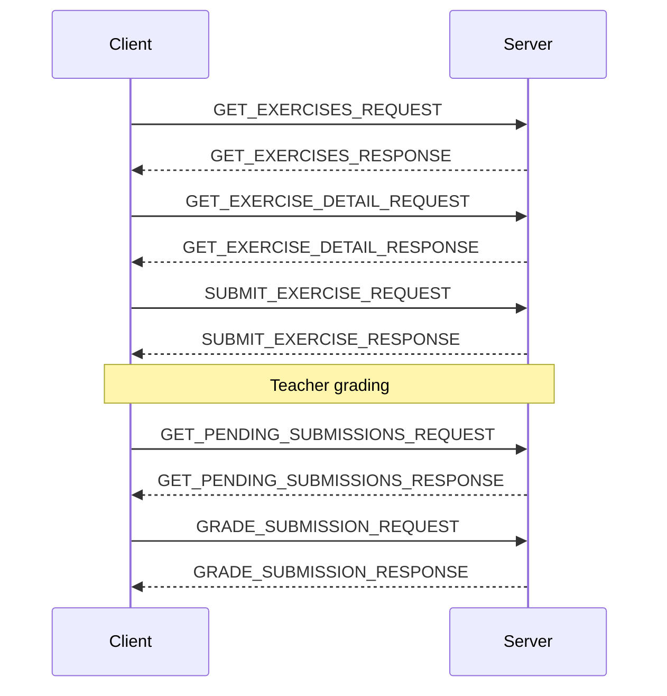
```mermaid
sequenceDiagram
    participant C as Client
    participant S as Server

    C->>S: GET_EXERCISES_REQUEST
    S-->>C: GET_EXERCISES_RESPONSE

    C->>S: GET_EXERCISE_DETAIL_REQUEST
    S-->>C: GET_EXERCISE_DETAIL_RESPONSE

    C->>S: SUBMIT_EXERCISE_REQUEST
    S-->>C: SUBMIT_EXERCISE_RESPONSE

    Note over C,S: Teacher grading

    C->>S: GET_PENDING_SUBMISSIONS_REQUEST
    S-->>C: GET_PENDING_SUBMISSIONS_RESPONSE

    C->>S: GRADE_SUBMISSION_REQUEST
    S-->>C: GRADE_SUBMISSION_RESPONSE
```

##### GET_EXERCISES_REQUEST

```json
{
    "messageType": "GET_EXERCISES_REQUEST",
    "sessionToken": "token_xyz789",
    "payload": {
        "exerciseType": "writing",
        "level": "beginner",
        "topic": "daily_life"
    }
}
```

##### GET_EXERCISES_RESPONSE

```json
{
    "messageType": "GET_EXERCISES_RESPONSE",
    "payload": {
        "status": "success",
        "data": {
            "total": 2,
            "exercises": [
                {
                    "exerciseId": "ex_001",
                    "title": "My Daily Routine",
                    "exerciseType": "writing",
                    "level": "beginner",
                    "duration": "30 minutes"
                },
                {
                    "exerciseId": "ex_002",
                    "title": "Pronunciation Practice",
                    "exerciseType": "speaking",
                    "level": "beginner",
                    "duration": "15 minutes"
                }
            ]
        }
    }
}
```

##### SUBMIT_EXERCISE_REQUEST

```json
{
    "messageType": "SUBMIT_EXERCISE_REQUEST",
    "sessionToken": "token_xyz789",
    "payload": {
        "exerciseId": "ex_001",
        "exerciseType": "writing",
        "content": "I wake up at 6 AM every day. First, I brush my teeth...",
        "audioUrl": ""
    }
}
```

##### GRADE_SUBMISSION_REQUEST (Teacher)

```json
{
    "messageType": "GRADE_SUBMISSION_REQUEST",
    "sessionToken": "teacher_token",
    "payload": {
        "submissionId": "sub_001",
        "score": 85,
        "feedback": "Good work! Your grammar is correct. Try to use more varied vocabulary."
    }
}
```

---

#### 2.4.5. Game Messages

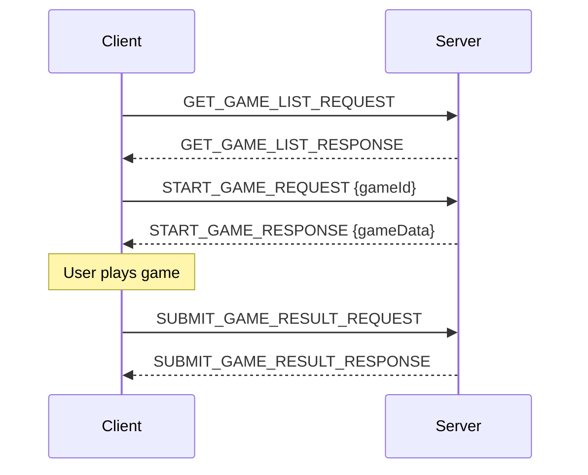
```mermaid
sequenceDiagram
    participant C as Client
    participant S as Server

    C->>S: GET_GAME_LIST_REQUEST
    S-->>C: GET_GAME_LIST_RESPONSE

    C->>S: START_GAME_REQUEST {gameId}
    S-->>C: START_GAME_RESPONSE {gameData}

    Note over C: User plays game

    C->>S: SUBMIT_GAME_RESULT_REQUEST
    S-->>C: SUBMIT_GAME_RESULT_RESPONSE
```

##### GET_GAME_LIST_REQUEST

```json
{
    "messageType": "GET_GAME_LIST_REQUEST",
    "sessionToken": "token_xyz789",
    "payload": {
        "gameType": "all",
        "level": "beginner"
    }
}
```

##### GET_GAME_LIST_RESPONSE

```json
{
    "messageType": "GET_GAME_LIST_RESPONSE",
    "payload": {
        "status": "success",
        "data": {
            "games": [
                {
                    "gameId": "game_001",
                    "title": "Word Match",
                    "gameType": "word_match",
                    "level": "beginner",
                    "description": "Match English words with Vietnamese meanings"
                },
                {
                    "gameId": "game_004",
                    "title": "Fruit Pictures",
                    "gameType": "picture_match",
                    "level": "beginner",
                    "description": "Match words with fruit images"
                }
            ]
        }
    }
}
```

##### START_GAME_REQUEST

```json
{
    "messageType": "START_GAME_REQUEST",
    "sessionToken": "token_xyz789",
    "payload": {
        "gameId": "game_004"
    }
}
```

##### START_GAME_RESPONSE (Picture Match)

```json
{
    "messageType": "START_GAME_RESPONSE",
    "payload": {
        "status": "success",
        "data": {
            "gameSessionId": "gs_001",
            "gameId": "game_004",
            "gameType": "picture_match",
            "title": "Fruit Pictures",
            "timeLimit": 120,
            "maxScore": 100,
            "pairs": [
                {
                    "word": "Apple",
                    "imageUrl": "https://cdn-icons-png.flaticon.com/128/415/415682.png"
                },
                {
                    "word": "Banana",
                    "imageUrl": "https://cdn-icons-png.flaticon.com/128/3143/3143643.png"
                },
                {
                    "word": "Orange",
                    "imageUrl": "https://cdn-icons-png.flaticon.com/128/415/415733.png"
                }
            ]
        }
    }
}
```

##### START_GAME_RESPONSE (Word Match)

```json
{
    "messageType": "START_GAME_RESPONSE",
    "payload": {
        "status": "success",
        "data": {
            "gameSessionId": "gs_002",
            "gameId": "game_001",
            "gameType": "word_match",
            "title": "Word Match",
            "timeLimit": 180,
            "pairs": [
                {"left": "Hello", "right": "Xin chào"},
                {"left": "Goodbye", "right": "Tạm biệt"},
                {"left": "Thank you", "right": "Cảm ơn"}
            ]
        }
    }
}
```

##### SUBMIT_GAME_RESULT_REQUEST

```json
{
    "messageType": "SUBMIT_GAME_RESULT_REQUEST",
    "sessionToken": "token_xyz789",
    "payload": {
        "gameSessionId": "gs_001",
        "gameId": "game_004",
        "matches": [
            {"word": "Apple", "imageUrl": "https://...415682.png"},
            {"word": "Banana", "imageUrl": "https://...3143643.png"},
            {"word": "Orange", "imageUrl": "https://...415733.png"}
        ]
    }
}
```

##### SUBMIT_GAME_RESULT_RESPONSE

```json
{
    "messageType": "SUBMIT_GAME_RESULT_RESPONSE",
    "payload": {
        "status": "success",
        "data": {
            "score": 100,
            "maxScore": 100,
            "correctMatches": 3,
            "totalPairs": 3,
            "timeUsed": 45,
            "feedback": "Excellent! Perfect score!"
        }
    }
}
```

---

#### 2.4.6. Chat Messages

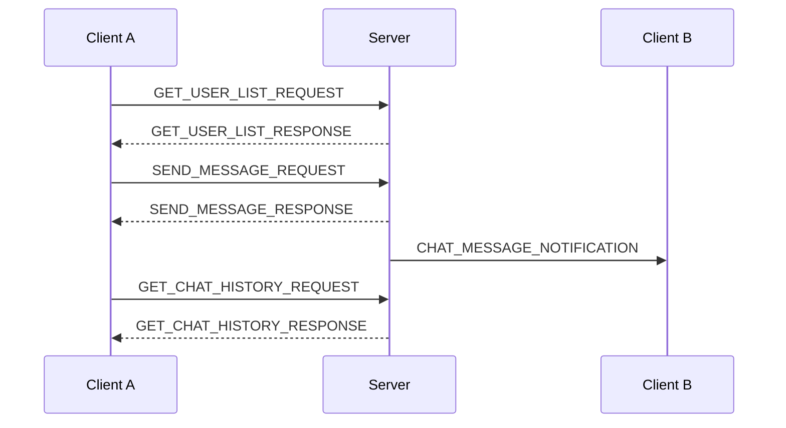
```mermaid
sequenceDiagram
    participant A as Client A
    participant S as Server
    participant B as Client B

    A->>S: GET_USER_LIST_REQUEST
    S-->>A: GET_USER_LIST_RESPONSE

    A->>S: SEND_MESSAGE_REQUEST
    S-->>A: SEND_MESSAGE_RESPONSE
    S->>B: CHAT_MESSAGE_NOTIFICATION

    A->>S: GET_CHAT_HISTORY_REQUEST
    S-->>A: GET_CHAT_HISTORY_RESPONSE
```

##### GET_USER_LIST_REQUEST

```json
{
    "messageType": "GET_USER_LIST_REQUEST",
    "sessionToken": "token_xyz789",
    "payload": {}
}
```

##### GET_USER_LIST_RESPONSE

```json
{
    "messageType": "GET_USER_LIST_RESPONSE",
    "payload": {
        "status": "success",
        "data": {
            "users": [
                {
                    "userId": "user_002",
                    "fullname": "Teacher Sarah",
                    "role": "teacher",
                    "online": true
                },
                {
                    "userId": "user_003",
                    "fullname": "Student Bob",
                    "role": "student",
                    "online": false
                }
            ]
        }
    }
}
```

##### SEND_MESSAGE_REQUEST

```json
{
    "messageType": "SEND_MESSAGE_REQUEST",
    "sessionToken": "token_xyz789",
    "payload": {
        "recipientId": "user_002",
        "messageContent": "Hello teacher, I have a question about grammar."
    }
}
```

##### SEND_MESSAGE_RESPONSE

```json
{
    "messageType": "SEND_MESSAGE_RESPONSE",
    "payload": {
        "status": "success",
        "data": {
            "messageId": "chat_msg_001",
            "sentAt": 1704067200000
        }
    }
}
```

##### CHAT_MESSAGE_NOTIFICATION

```json
{
    "messageType": "CHAT_MESSAGE_NOTIFICATION",
    "timestamp": 1704067200000,
    "payload": {
        "senderId": "user_001",
        "senderName": "Nguyen Van A",
        "messageContent": "Hello teacher, I have a question about grammar.",
        "sentAt": 1704067200000
    }
}
```

##### GET_CHAT_HISTORY_REQUEST

```json
{
    "messageType": "GET_CHAT_HISTORY_REQUEST",
    "sessionToken": "token_xyz789",
    "payload": {
        "senderId": "user_002"
    }
}
```

##### GET_CHAT_HISTORY_RESPONSE

```json
{
    "messageType": "GET_CHAT_HISTORY_RESPONSE",
    "payload": {
        "status": "success",
        "data": {
            "messages": [
                {
                    "messageId": "chat_001",
                    "senderId": "user_001",
                    "senderName": "Nguyen Van A",
                    "content": "Hello teacher!",
                    "timestamp": 1704060000000
                },
                {
                    "messageId": "chat_002",
                    "senderId": "user_002",
                    "senderName": "Teacher Sarah",
                    "content": "Hi! How can I help you?",
                    "timestamp": 1704060060000
                }
            ]
        }
    }
}
```

##### UNREAD_MESSAGES_NOTIFICATION

```json
{
    "messageType": "UNREAD_MESSAGES_NOTIFICATION",
    "timestamp": 1704067200000,
    "payload": {
        "unreadCount": 3,
        "messages": [
            {
                "senderId": "user_002",
                "senderName": "Teacher Sarah",
                "content": "Don't forget to submit your homework!",
                "timestamp": 1704066000000
            }
        ]
    }
}
```

---

#### 2.4.7. Voice Call Messages

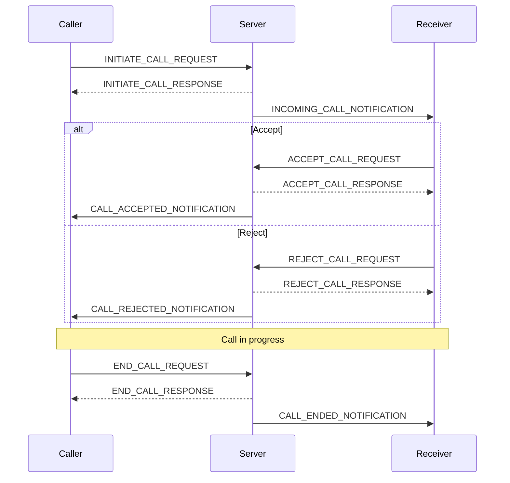
```mermaid
sequenceDiagram
    participant A as Caller
    participant S as Server
    participant B as Receiver

    A->>S: INITIATE_CALL_REQUEST
    S-->>A: INITIATE_CALL_RESPONSE
    S->>B: INCOMING_CALL_NOTIFICATION

    alt Accept
        B->>S: ACCEPT_CALL_REQUEST
        S-->>B: ACCEPT_CALL_RESPONSE
        S->>A: CALL_ACCEPTED_NOTIFICATION
    else Reject
        B->>S: REJECT_CALL_REQUEST
        S-->>B: REJECT_CALL_RESPONSE
        S->>A: CALL_REJECTED_NOTIFICATION
    end

    Note over A,B: Call in progress

    A->>S: END_CALL_REQUEST
    S-->>A: END_CALL_RESPONSE
    S->>B: CALL_ENDED_NOTIFICATION
```

##### INITIATE_CALL_REQUEST

```json
{
    "messageType": "INITIATE_CALL_REQUEST",
    "sessionToken": "token_xyz789",
    "payload": {
        "receiverId": "user_002",
        "audioSource": "microphone"
    }
}
```

##### INITIATE_CALL_RESPONSE

```json
{
    "messageType": "INITIATE_CALL_RESPONSE",
    "payload": {
        "status": "success",
        "data": {
            "callId": "call_001",
            "receiverName": "Teacher Sarah",
            "callStatus": "ringing"
        }
    }
}
```

##### INCOMING_CALL_NOTIFICATION

```json
{
    "messageType": "INCOMING_CALL_NOTIFICATION",
    "timestamp": 1704067200000,
    "payload": {
        "callId": "call_001",
        "callerId": "user_001",
        "callerName": "Nguyen Van A",
        "audioSource": "microphone"
    }
}
```

##### ACCEPT_CALL_REQUEST

```json
{
    "messageType": "ACCEPT_CALL_REQUEST",
    "sessionToken": "teacher_token",
    "payload": {
        "callId": "call_001"
    }
}
```

##### CALL_ACCEPTED_NOTIFICATION

```json
{
    "messageType": "CALL_ACCEPTED_NOTIFICATION",
    "timestamp": 1704067205000,
    "payload": {
        "callId": "call_001",
        "receiverName": "Teacher Sarah"
    }
}
```

##### END_CALL_REQUEST

```json
{
    "messageType": "END_CALL_REQUEST",
    "sessionToken": "token_xyz789",
    "payload": {
        "callId": "call_001"
    }
}
```

##### CALL_ENDED_NOTIFICATION

```json
{
    "messageType": "CALL_ENDED_NOTIFICATION",
    "timestamp": 1704067500000,
    "payload": {
        "callId": "call_001",
        "duration": 295,
        "endedBy": "caller"
    }
}
```

---

### 2.5. Bảng Tổng Hợp Message Types

| Category | Message Type | Direction | Mô tả |
|----------|--------------|-----------|-------|
| **Auth** | REGISTER_REQUEST | C→S | Đăng ký tài khoản |
| | REGISTER_RESPONSE | S→C | Kết quả đăng ký |
| | LOGIN_REQUEST | C→S | Đăng nhập |
| | LOGIN_RESPONSE | S→C | Kết quả đăng nhập |
| **Lesson** | GET_LESSONS_REQUEST | C→S | Lấy danh sách bài học |
| | GET_LESSONS_RESPONSE | S→C | Danh sách bài học |
| | GET_LESSON_DETAIL_REQUEST | C→S | Lấy chi tiết bài học |
| | GET_LESSON_DETAIL_RESPONSE | S→C | Chi tiết bài học |
| **Test** | GET_TEST_REQUEST | C→S | Lấy bài thi |
| | GET_TEST_RESPONSE | S→C | Dữ liệu bài thi |
| | SUBMIT_TEST_REQUEST | C→S | Nộp bài thi |
| | SUBMIT_TEST_RESPONSE | S→C | Kết quả chấm |
| **Exercise** | GET_EXERCISES_REQUEST | C→S | Lấy bài tập |
| | GET_EXERCISES_RESPONSE | S→C | Danh sách bài tập |
| | SUBMIT_EXERCISE_REQUEST | C→S | Nộp bài tập |
| | SUBMIT_EXERCISE_RESPONSE | S→C | Xác nhận nộp |
| | GRADE_SUBMISSION_REQUEST | C→S | Chấm bài (Teacher) |
| | GRADE_SUBMISSION_RESPONSE | S→C | Kết quả chấm |
| **Game** | GET_GAME_LIST_REQUEST | C→S | Lấy danh sách game |
| | GET_GAME_LIST_RESPONSE | S→C | Danh sách game |
| | START_GAME_REQUEST | C→S | Bắt đầu game |
| | START_GAME_RESPONSE | S→C | Dữ liệu game |
| | SUBMIT_GAME_RESULT_REQUEST | C→S | Nộp kết quả |
| | SUBMIT_GAME_RESULT_RESPONSE | S→C | Điểm số |
| **Chat** | GET_USER_LIST_REQUEST | C→S | Lấy danh sách user |
| | GET_USER_LIST_RESPONSE | S→C | Danh sách user |
| | SEND_MESSAGE_REQUEST | C→S | Gửi tin nhắn |
| | SEND_MESSAGE_RESPONSE | S→C | Xác nhận gửi |
| | GET_CHAT_HISTORY_REQUEST | C→S | Lấy lịch sử chat |
| | GET_CHAT_HISTORY_RESPONSE | S→C | Lịch sử chat |
| | CHAT_MESSAGE_NOTIFICATION | S→C | Tin nhắn mới |
| | UNREAD_MESSAGES_NOTIFICATION | S→C | Tin nhắn chưa đọc |
| **Voice** | INITIATE_CALL_REQUEST | C→S | Khởi tạo cuộc gọi |
| | INITIATE_CALL_RESPONSE | S→C | Kết quả khởi tạo |
| | ACCEPT_CALL_REQUEST | C→S | Chấp nhận cuộc gọi |
| | REJECT_CALL_REQUEST | C→S | Từ chối cuộc gọi |
| | END_CALL_REQUEST | C→S | Kết thúc cuộc gọi |
| | INCOMING_CALL_NOTIFICATION | S→C | Báo có cuộc gọi đến |
| | CALL_ACCEPTED_NOTIFICATION | S→C | Cuộc gọi được chấp nhận |
| | CALL_REJECTED_NOTIFICATION | S→C | Cuộc gọi bị từ chối |
| | CALL_ENDED_NOTIFICATION | S→C | Cuộc gọi kết thúc |

---

## 3. State Machine

### 3.1. Client State Machine

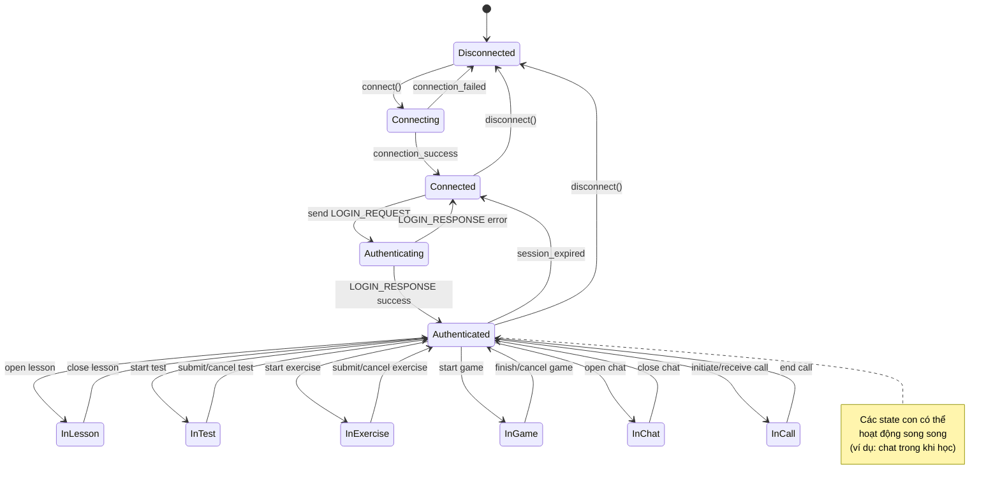
```mermaid
stateDiagram-v2
    [*] --> Disconnected

    Disconnected --> Connecting: connect()
    Connecting --> Connected: connection_success
    Connecting --> Disconnected: connection_failed

    Connected --> Authenticating: send LOGIN_REQUEST
    Authenticating --> Authenticated: LOGIN_RESPONSE success
    Authenticating --> Connected: LOGIN_RESPONSE error

    Authenticated --> InLesson: open lesson
    Authenticated --> InTest: start test
    Authenticated --> InExercise: start exercise
    Authenticated --> InGame: start game
    Authenticated --> InChat: open chat
    Authenticated --> InCall: initiate/receive call

    InLesson --> Authenticated: close lesson
    InTest --> Authenticated: submit/cancel test
    InExercise --> Authenticated: submit/cancel exercise
    InGame --> Authenticated: finish/cancel game
    InChat --> Authenticated: close chat
    InCall --> Authenticated: end call

    Authenticated --> Connected: session_expired
    Connected --> Disconnected: disconnect()
    Authenticated --> Disconnected: disconnect()

    note right of Authenticated
        Các state con có thể
        hoạt động song song
        (ví dụ: chat trong khi học)
    end note
```

### 3.2. Chi Tiết Các State

| State | Mô tả | Actions có thể thực hiện |
|-------|-------|-------------------------|
| **Disconnected** | Chưa kết nối server | connect() |
| **Connecting** | Đang kết nối | Chờ kết quả |
| **Connected** | Đã kết nối, chưa đăng nhập | login(), register() |
| **Authenticating** | Đang xác thực | Chờ response |
| **Authenticated** | Đã đăng nhập | Tất cả chức năng |
| **InLesson** | Đang xem bài học | Xem nội dung, đóng |
| **InTest** | Đang làm bài thi | Trả lời, nộp bài |
| **InExercise** | Đang làm bài tập | Làm bài, nộp bài |
| **InGame** | Đang chơi game | Chơi, nộp kết quả |
| **InChat** | Đang chat | Gửi/nhận tin nhắn |
| **InCall** | Đang trong cuộc gọi | Nói, nghe, kết thúc |

### 3.3. Server-side Session State Machine

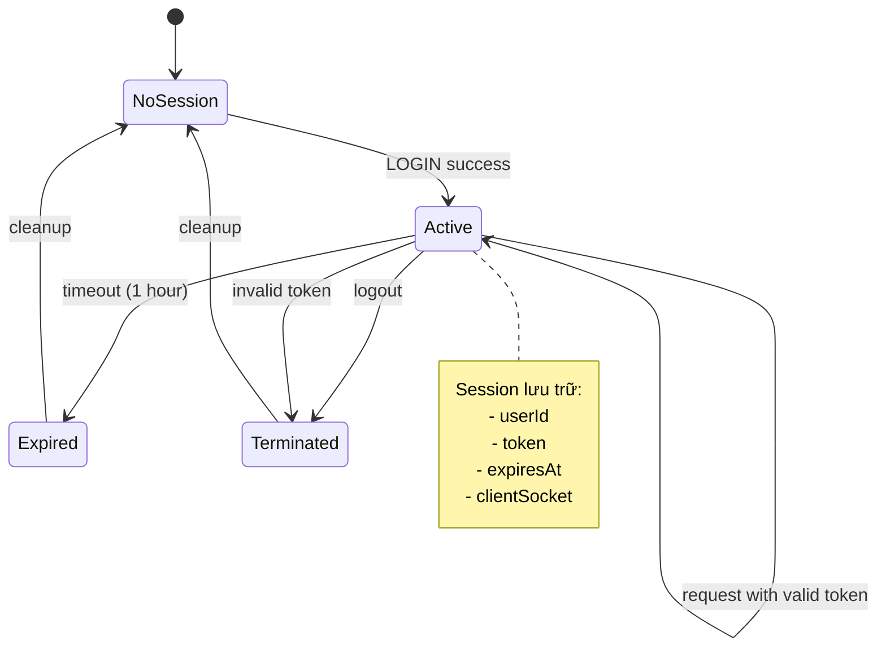
```mermaid
stateDiagram-v2
    [*] --> NoSession

    NoSession --> Active: LOGIN success
    Active --> Active: request with valid token
    Active --> Expired: timeout (1 hour)
    Active --> Terminated: logout
    Active --> Terminated: invalid token

    Expired --> NoSession: cleanup
    Terminated --> NoSession: cleanup

    note right of Active
        Session lưu trữ:
        - userId
        - token
        - expiresAt
        - clientSocket
    end note
```

### 3.4. Voice Call State Machine

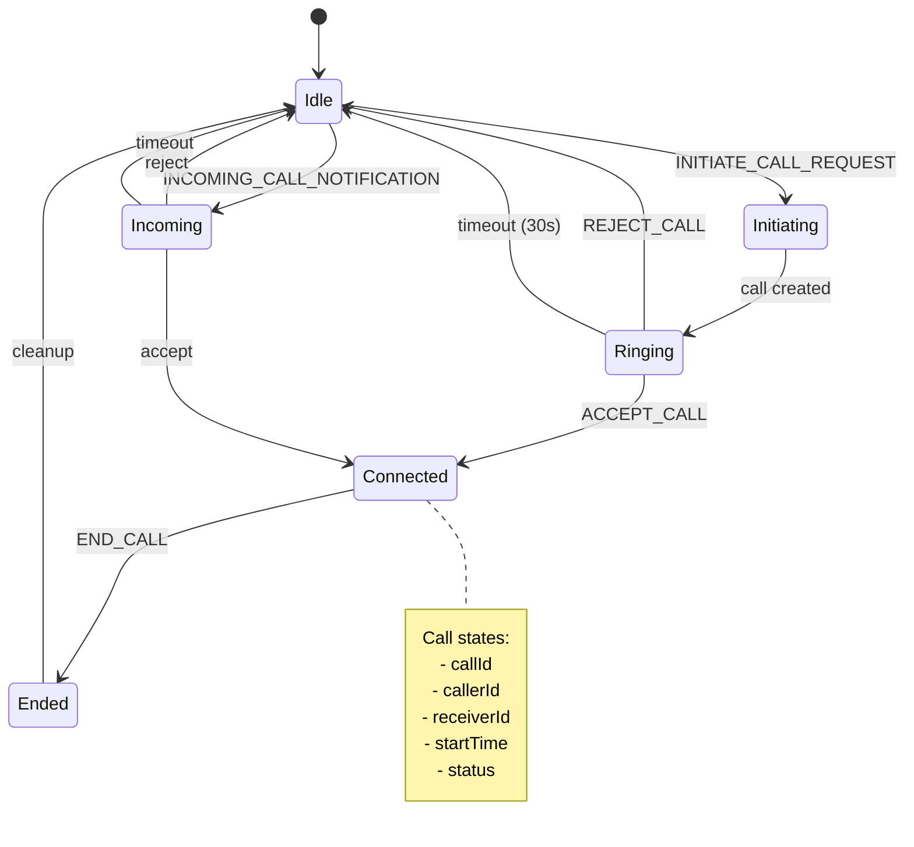
```mermaid
stateDiagram-v2
    [*] --> Idle

    Idle --> Initiating: INITIATE_CALL_REQUEST
    Initiating --> Ringing: call created
    Ringing --> Connected: ACCEPT_CALL
    Ringing --> Idle: REJECT_CALL
    Ringing --> Idle: timeout (30s)
    Connected --> Ended: END_CALL
    Ended --> Idle: cleanup

    Idle --> Incoming: INCOMING_CALL_NOTIFICATION
    Incoming --> Connected: accept
    Incoming --> Idle: reject
    Incoming --> Idle: timeout

    note right of Connected
        Call states:
        - callId
        - callerId
        - receiverId
        - startTime
        - status
    end note
```

### 3.5. Chat Conversation State

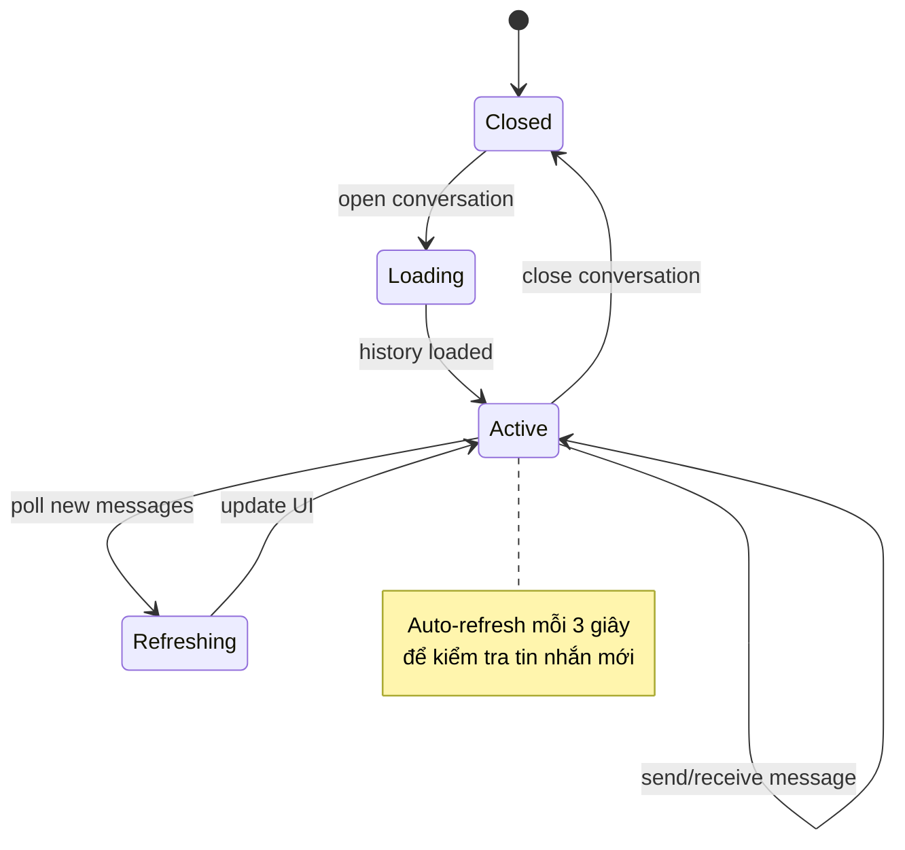
```mermaid
stateDiagram-v2
    [*] --> Closed

    Closed --> Loading: open conversation
    Loading --> Active: history loaded
    Active --> Active: send/receive message
    Active --> Refreshing: poll new messages
    Refreshing --> Active: update UI
    Active --> Closed: close conversation

    note right of Active
        Auto-refresh mỗi 3 giây
        để kiểm tra tin nhắn mới
    end note
```

### 3.6. Game Session State Machine

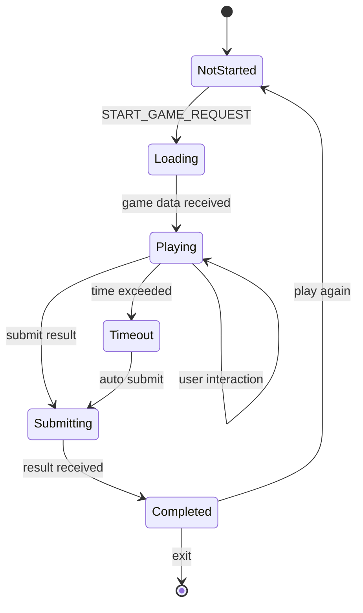
```mermaid
stateDiagram-v2
    [*] --> NotStarted

    NotStarted --> Loading: START_GAME_REQUEST
    Loading --> Playing: game data received
    Playing --> Playing: user interaction
    Playing --> Submitting: submit result
    Submitting --> Completed: result received
    Completed --> NotStarted: play again
    Completed --> [*]: exit

    Playing --> Timeout: time exceeded
    Timeout --> Submitting: auto submit
```

---

## 4. Xử Lý Bản Tin

### 4.1. Kiến Trúc Xử Lý

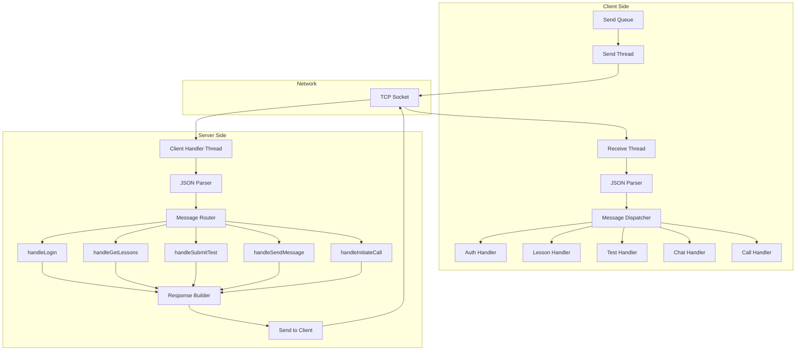
```mermaid
graph TB
    subgraph "Client Side"
        CR[Receive Thread] --> CP[JSON Parser]
        CP --> CD[Message Dispatcher]
        CD --> CH1[Auth Handler]
        CD --> CH2[Lesson Handler]
        CD --> CH3[Test Handler]
        CD --> CH4[Chat Handler]
        CD --> CH5[Call Handler]

        CS[Send Queue] --> CW[Send Thread]
    end

    subgraph "Network"
        NET[TCP Socket]
    end

    subgraph "Server Side"
        SR[Client Handler Thread] --> SP[JSON Parser]
        SP --> SD[Message Router]
        SD --> SH1[handleLogin]
        SD --> SH2[handleGetLessons]
        SD --> SH3[handleSubmitTest]
        SD --> SH4[handleSendMessage]
        SD --> SH5[handleInitiateCall]

        SH1 & SH2 & SH3 & SH4 & SH5 --> SB[Response Builder]
        SB --> SW[Send to Client]
    end

    CW --> NET
    NET --> SR
    SW --> NET
    NET --> CR
```

### 4.2. Xử Lý Phía Client

#### 4.2.1. Receive Thread

```cpp
void receiveThreadFunc() {
    while (running) {
        // 1. Đọc length prefix (4 bytes)
        uint32_t length;
        int bytesRead = recv(sock, &length, sizeof(length), 0);
        if (bytesRead <= 0) {
            // Connection lost
            handleDisconnect();
            break;
        }
        length = ntohl(length);

        // 2. Đọc message body
        std::string message(length, '\0');
        bytesRead = recv(sock, &message[0], length, 0);

        // 3. Parse và dispatch
        std::string messageType = getJsonValue(message, "messageType");
        dispatchMessage(messageType, message);
    }
}
```

#### 4.2.2. Message Dispatcher

```cpp
void dispatchMessage(const std::string& type, const std::string& message) {
    if (type == "LOGIN_RESPONSE") {
        handleLoginResponse(message);
    }
    else if (type == "CHAT_MESSAGE_NOTIFICATION") {
        handleChatNotification(message);
    }
    else if (type == "INCOMING_CALL_NOTIFICATION") {
        handleIncomingCall(message);
    }
    else if (type == "UNREAD_MESSAGES_NOTIFICATION") {
        handleUnreadMessages(message);
    }
    // ... other handlers
}
```

#### 4.2.3. Response Handlers

```cpp
void handleLoginResponse(const std::string& response) {
    std::string status = getJsonValue(response, "status");

    if (status == "success") {
        // Extract data
        std::string data = getJsonObject(response, "data");
        sessionToken = getJsonValue(data, "sessionToken");
        currentUserId = getJsonValue(data, "userId");
        currentRole = getJsonValue(data, "role");
        currentLevel = getJsonValue(data, "level");

        // Update UI
        showMainMenu();
    } else {
        // Show error
        std::string errorMsg = getJsonValue(response, "message");
        showError(errorMsg);
    }
}
```

#### 4.2.4. Notification Handlers

```cpp
void handleChatNotification(const std::string& notification) {
    std::string payload = getJsonObject(notification, "payload");
    std::string senderId = getJsonValue(payload, "senderId");
    std::string senderName = getJsonValue(payload, "senderName");
    std::string content = getJsonValue(payload, "messageContent");

    // Update UI on main thread
    g_idle_add([](gpointer data) -> gboolean {
        // Add message to chat window
        updateChatUI(senderId, senderName, content);
        // Play notification sound
        playNotificationSound();
        // Show popup
        showNotificationPopup(senderName, content);
        return FALSE;
    }, nullptr);
}
```

### 4.3. Xử Lý Phía Server

#### 4.3.1. Client Handler Thread

```cpp
void handleClient(int clientSocket) {
    char buffer[BUFFER_SIZE];

    while (running) {
        // 1. Đọc length prefix
        uint32_t length;
        if (recv(clientSocket, &length, sizeof(length), 0) <= 0) {
            break;
        }
        length = ntohl(length);

        // 2. Đọc message
        std::string message(length, '\0');
        recv(clientSocket, &message[0], length, 0);

        // 3. Log
        logMessage("RECV", "Client:" + std::to_string(clientSocket), message);

        // 4. Parse và route
        std::string messageType = getJsonValue(message, "messageType");
        std::string response = routeMessage(messageType, message, clientSocket);

        // 5. Gửi response (nếu có)
        if (!response.empty()) {
            sendResponse(clientSocket, response);
        }
    }

    // Cleanup
    handleClientDisconnect(clientSocket);
}
```

#### 4.3.2. Message Router

```cpp
std::string routeMessage(const std::string& type,
                         const std::string& message,
                         int clientSocket) {
    // Authentication messages (không cần token)
    if (type == "REGISTER_REQUEST") {
        return handleRegister(message);
    }
    if (type == "LOGIN_REQUEST") {
        return handleLogin(message, clientSocket);
    }

    // Các message khác cần xác thực token
    std::string token = getJsonValue(message, "sessionToken");
    if (!validateSession(token)) {
        return buildErrorResponse("AUTH_002", "Session expired");
    }

    // Route đến handler tương ứng
    if (type == "GET_LESSONS_REQUEST") {
        return handleGetLessons(message);
    }
    else if (type == "GET_TEST_REQUEST") {
        return handleGetTest(message);
    }
    else if (type == "SUBMIT_TEST_REQUEST") {
        return handleSubmitTest(message);
    }
    else if (type == "SEND_MESSAGE_REQUEST") {
        return handleSendMessage(message, clientSocket);
    }
    else if (type == "INITIATE_CALL_REQUEST") {
        return handleInitiateCall(message, clientSocket);
    }
    // ... other handlers

    return buildErrorResponse("UNKNOWN", "Unknown message type");
}
```

#### 4.3.3. Request Handlers

```cpp
std::string handleLogin(const std::string& json, int clientSocket) {
    // 1. Parse request
    std::string payload = getJsonObject(json, "payload");
    std::string email = getJsonValue(payload, "email");
    std::string password = getJsonValue(payload, "password");

    // 2. Validate credentials
    std::lock_guard<std::mutex> lock(usersMutex);
    auto it = users.find(email);
    if (it == users.end() || it->second.password != password) {
        return buildErrorResponse("AUTH_001", "Invalid email or password");
    }

    // 3. Create session
    User& user = it->second;
    user.online = true;
    user.clientSocket = clientSocket;

    std::string token = generateSessionToken();
    Session session;
    session.sessionToken = token;
    session.userId = user.userId;
    session.expiresAt = getCurrentTimestamp() + 3600000; // 1 hour

    {
        std::lock_guard<std::mutex> slock(sessionsMutex);
        sessions[token] = session;
        clientSessions[clientSocket] = token;
    }

    // 4. Build response
    return buildLoginResponse(user, token, session.expiresAt);
}
```

#### 4.3.4. Forward Notifications

```cpp
void forwardChatMessage(const std::string& senderId,
                        const std::string& senderName,
                        const std::string& recipientId,
                        const std::string& content) {
    // Find recipient's socket
    int recipientSocket = -1;
    {
        std::lock_guard<std::mutex> lock(usersMutex);
        if (userById.count(recipientId) && userById[recipientId]->online) {
            recipientSocket = userById[recipientId]->clientSocket;
        }
    }

    if (recipientSocket > 0) {
        // Build notification
        std::string notification = R"({
            "messageType": "CHAT_MESSAGE_NOTIFICATION",
            "timestamp": )" + std::to_string(getCurrentTimestamp()) + R"(,
            "payload": {
                "senderId": ")" + senderId + R"(",
                "senderName": ")" + escapeJson(senderName) + R"(",
                "messageContent": ")" + escapeJson(content) + R"("
            }
        })";

        // Send to recipient
        sendResponse(recipientSocket, notification);
    } else {
        // Queue for offline delivery
        queueOfflineMessage(recipientId, senderId, senderName, content);
    }
}
```

### 4.4. Error Handling

#### 4.4.1. Error Response Format

```json
{
    "messageType": "ERROR_RESPONSE",
    "timestamp": 1704067200000,
    "payload": {
        "status": "error",
        "errorCode": "ERROR_CODE",
        "message": "Human readable error message"
    }
}
```

#### 4.4.2. Error Codes

| Code | Mô tả | HTTP tương đương |
|------|-------|------------------|
| AUTH_001 | Invalid credentials | 401 |
| AUTH_002 | Session expired | 401 |
| AUTH_003 | Permission denied | 403 |
| DATA_001 | Resource not found | 404 |
| DATA_002 | Invalid data format | 400 |
| DATA_003 | Duplicate entry | 409 |
| SYS_001 | Internal server error | 500 |
| SYS_002 | Service unavailable | 503 |

#### 4.4.3. Client-side Error Handling

```cpp
void handleResponse(const std::string& response) {
    std::string status = getJsonValue(response, "status");

    if (status == "error") {
        std::string errorCode = getJsonValue(response, "errorCode");
        std::string message = getJsonValue(response, "message");

        if (errorCode == "AUTH_002") {
            // Session expired - redirect to login
            clearSession();
            showLoginScreen();
        } else if (errorCode == "AUTH_003") {
            // Permission denied
            showError("Bạn không có quyền thực hiện hành động này");
        } else {
            // General error
            showError(message);
        }
    }
}
```

### 4.5. Validation

#### 4.5.1. Client-side Validation

```cpp
bool validateLoginInput(const std::string& email, const std::string& password) {
    // Email format
    std::regex emailRegex(R"([a-zA-Z0-9._%+-]+@[a-zA-Z0-9.-]+\.[a-zA-Z]{2,})");
    if (!std::regex_match(email, emailRegex)) {
        showError("Email không hợp lệ");
        return false;
    }

    // Password length
    if (password.length() < 6) {
        showError("Mật khẩu phải có ít nhất 6 ký tự");
        return false;
    }

    return true;
}
```

#### 4.5.2. Server-side Validation

```cpp
std::string validateRegisterData(const std::string& payload) {
    std::string fullname = getJsonValue(payload, "fullname");
    std::string email = getJsonValue(payload, "email");
    std::string password = getJsonValue(payload, "password");
    std::string confirm = getJsonValue(payload, "confirmPassword");

    if (fullname.empty() || email.empty() || password.empty()) {
        return "All fields are required";
    }

    if (password != confirm) {
        return "Passwords do not match";
    }

    if (password.length() < 6) {
        return "Password must be at least 6 characters";
    }

    // Check duplicate email
    if (users.count(email)) {
        return "Email already registered";
    }

    return ""; // Valid
}
```

### 4.6. Security Considerations

#### 4.6.1. Token Validation

```cpp
bool validateSession(const std::string& token) {
    if (token.empty()) return false;

    std::lock_guard<std::mutex> lock(sessionsMutex);
    auto it = sessions.find(token);
    if (it == sessions.end()) return false;

    // Check expiration
    if (it->second.expiresAt < getCurrentTimestamp()) {
        sessions.erase(it);
        return false;
    }

    return true;
}
```

#### 4.6.2. Permission Check

```cpp
bool checkPermission(const std::string& userId, const std::string& action) {
    std::lock_guard<std::mutex> lock(usersMutex);

    if (!userById.count(userId)) return false;
    User* user = userById[userId];

    // Define permission matrix
    if (action == "GRADE_SUBMISSION") {
        return user->role == "teacher" || user->role == "admin";
    }
    if (action == "CREATE_CONTENT") {
        return user->role == "teacher" || user->role == "admin";
    }
    if (action == "MANAGE_USERS") {
        return user->role == "admin";
    }

    return true; // Default allow for basic actions
}
```

---

## 5. Ví Dụ Minh Họa

### 5.1. Ví Dụ: Login Flow Hoàn Chỉnh

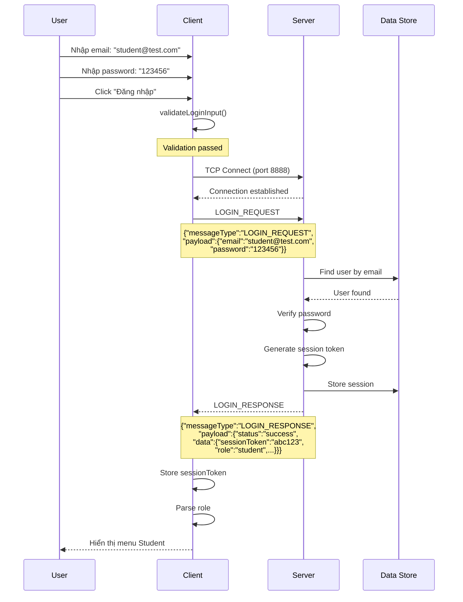
```mermaid
sequenceDiagram
    participant U as User
    participant C as Client
    participant S as Server
    participant DB as Data Store

    U->>C: Nhập email: "student@test.com"
    U->>C: Nhập password: "123456"
    U->>C: Click "Đăng nhập"

    C->>C: validateLoginInput()
    Note over C: Validation passed

    C->>S: TCP Connect (port 8888)
    S-->>C: Connection established

    C->>S: LOGIN_REQUEST
    Note over C,S: {"messageType":"LOGIN_REQUEST",<br/>"payload":{"email":"student@test.com",<br/>"password":"123456"}}

    S->>DB: Find user by email
    DB-->>S: User found

    S->>S: Verify password
    S->>S: Generate session token
    S->>DB: Store session

    S-->>C: LOGIN_RESPONSE
    Note over C,S: {"messageType":"LOGIN_RESPONSE",<br/>"payload":{"status":"success",<br/>"data":{"sessionToken":"abc123",<br/>"role":"student",...}}}

    C->>C: Store sessionToken
    C->>C: Parse role
    C-->>U: Hiển thị menu Student
```

### 5.2. Ví Dụ: Chat Message Flow

**Bước 1: User A gửi tin nhắn**

```json
// Client A -> Server
{
    "messageType": "SEND_MESSAGE_REQUEST",
    "sessionToken": "token_A",
    "payload": {
        "recipientId": "user_B",
        "messageContent": "Hello, how are you?"
    }
}
```

**Bước 2: Server xử lý**

```cpp
// Server processing
1. Validate session token
2. Get sender info from token
3. Store message in chat history
4. Check if recipient is online
5. Forward notification to recipient
```

**Bước 3: Server trả response cho A**

```json
// Server -> Client A
{
    "messageType": "SEND_MESSAGE_RESPONSE",
    "payload": {
        "status": "success",
        "data": {
            "messageId": "msg_123",
            "sentAt": 1704067200000
        }
    }
}
```

**Bước 4: Server push notification cho B**

```json
// Server -> Client B
{
    "messageType": "CHAT_MESSAGE_NOTIFICATION",
    "timestamp": 1704067200000,
    "payload": {
        "senderId": "user_A",
        "senderName": "Nguyen Van A",
        "messageContent": "Hello, how are you?",
        "sentAt": 1704067200000
    }
}
```

### 5.3. Ví Dụ: Picture Match Game

**Bước 1: Start Game**

```json
// Request
{
    "messageType": "START_GAME_REQUEST",
    "sessionToken": "token_xyz",
    "payload": {"gameId": "game_004"}
}

// Response
{
    "messageType": "START_GAME_RESPONSE",
    "payload": {
        "status": "success",
        "data": {
            "gameSessionId": "gs_001",
            "gameType": "picture_match",
            "pairs": [
                {"word": "Apple", "imageUrl": "https://...415682.png"},
                {"word": "Banana", "imageUrl": "https://...3143643.png"}
            ]
        }
    }
}
```

**Bước 2: Client xử lý**

```cpp
// Client processing
1. Parse pairs from response
2. For each pair:
   - Download image from imageUrl
   - Create image button widget
3. Shuffle word order for display
4. Display game UI
5. Handle user clicks to match pairs
```

**Bước 3: Submit Result**

```json
// Request
{
    "messageType": "SUBMIT_GAME_RESULT_REQUEST",
    "sessionToken": "token_xyz",
    "payload": {
        "gameSessionId": "gs_001",
        "gameId": "game_004",
        "matches": [
            {"word": "Apple", "imageUrl": "https://...415682.png"},
            {"word": "Banana", "imageUrl": "https://...3143643.png"}
        ]
    }
}

// Response
{
    "messageType": "SUBMIT_GAME_RESULT_RESPONSE",
    "payload": {
        "status": "success",
        "data": {
            "score": 100,
            "correctMatches": 2,
            "totalPairs": 2
        }
    }
}
```

---

## Phụ Lục

### A. JSON Parser Functions

```cpp
// Lấy giá trị string từ JSON
std::string getJsonValue(const std::string& json, const std::string& key);

// Lấy object từ JSON
std::string getJsonObject(const std::string& json, const std::string& key);

// Lấy array từ JSON
std::string getJsonArray(const std::string& json, const std::string& key);

// Parse array thành vector
std::vector<std::string> parseJsonArray(const std::string& arrayStr);

// Escape special characters
std::string escapeJson(const std::string& str);
```

### B. Message Type Constants

```cpp
namespace MessageType {
    // Authentication
    const std::string REGISTER_REQUEST = "REGISTER_REQUEST";
    const std::string REGISTER_RESPONSE = "REGISTER_RESPONSE";
    const std::string LOGIN_REQUEST = "LOGIN_REQUEST";
    const std::string LOGIN_RESPONSE = "LOGIN_RESPONSE";

    // Lessons
    const std::string GET_LESSONS_REQUEST = "GET_LESSONS_REQUEST";
    const std::string GET_LESSONS_RESPONSE = "GET_LESSONS_RESPONSE";

    // Tests
    const std::string GET_TEST_REQUEST = "GET_TEST_REQUEST";
    const std::string SUBMIT_TEST_REQUEST = "SUBMIT_TEST_REQUEST";

    // Games
    const std::string START_GAME_REQUEST = "START_GAME_REQUEST";
    const std::string SUBMIT_GAME_RESULT_REQUEST = "SUBMIT_GAME_RESULT_REQUEST";

    // Chat
    const std::string SEND_MESSAGE_REQUEST = "SEND_MESSAGE_REQUEST";
    const std::string CHAT_MESSAGE_NOTIFICATION = "CHAT_MESSAGE_NOTIFICATION";

    // Voice Call
    const std::string INITIATE_CALL_REQUEST = "INITIATE_CALL_REQUEST";
    const std::string INCOMING_CALL_NOTIFICATION = "INCOMING_CALL_NOTIFICATION";
}
```

---

> **Tài liệu thiết kế giao thức tầng ứng dụng**
> English Learning Application
> © 2026
