# Thiết Kế Chi Tiết Ứng Dụng Học Tiếng Anh

> **English Learning Application - System Design Document**
> Phiên bản: 1.0
> Ngày cập nhật: Tháng 1/2026

---

## Mục Lục

1. [Mô Tả Ứng Dụng](#1-mô-tả-ứng-dụng)
2. [Luật Của Trò Chơi / Ứng Dụng](#2-luật-của-trò-chơi--ứng-dụng)
3. [Kiến Trúc Hệ Thống](#3-kiến-trúc-hệ-thống)
4. [Chức Năng Của Hệ Thống](#4-chức-năng-của-hệ-thống)
5. [Use Case](#5-use-case)
6. [Quy Trình Hoạt Động Của Từng Chức Năng](#6-quy-trình-hoạt-động-của-từng-chức-năng)
7. [Biểu Đồ Trình Tự](#7-biểu-đồ-trình-tự-sequence-diagram)
8. [Thiết Kế Bản Tin](#8-thiết-kế-bản-tin-message-design)
9. [Format Của Bản Tin](#9-format-của-bản-tin)
10. [Luồng Bản Tin Trong Từng Chức Năng](#10-luồng-bản-tin-trong-từng-chức-năng)
11. [Xử Lý Bản Tin Phía Client / Server](#11-xử-lý-bản-tin-phía-client--server)
12. [Đánh Giá Ứng Dụng](#12-đánh-giá-ứng-dụng)

---

## 1. Mô Tả Ứng Dụng

### 1.1. Mục Đích Ứng Dụng

**English Learning Application** là một ứng dụng học tiếng Anh toàn diện, được thiết kế theo mô hình Client-Server, cung cấp các tính năng:

- **Học bài (Lesson)**: Người dùng có thể truy cập các bài học theo cấp độ và chủ đề
- **Làm bài thi (Test)**: Kiểm tra kiến thức với các câu hỏi trắc nghiệm, điền từ, sắp xếp câu
- **Luyện tập (Exercise)**: Bài tập viết, phát âm với tính năng chấm điểm
- **Trò chơi (Game)**: Học qua các mini-game như ghép từ, ghép hình
- **Chat**: Giao tiếp real-time giữa học sinh và giáo viên
- **Voice Call**: Gọi thoại để luyện phát âm

### 1.2. Đối Tượng Sử Dụng

| Vai trò | Mô tả | Quyền hạn |
|---------|-------|-----------|
| **Student** | Học sinh, người học | Học bài, làm bài thi, luyện tập, chơi game, chat |
| **Teacher** | Giáo viên | Chấm bài, chat với học sinh, tạo nội dung |
| **Admin** | Quản trị viên | Toàn quyền quản lý hệ thống |

### 1.3. Phạm Vi và Bối Cảnh Sử Dụng

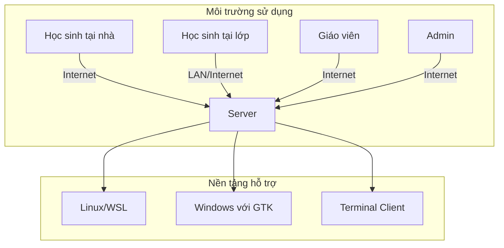
```mermaid
graph TB
    subgraph "Môi trường sử dụng"
        A[Học sinh tại nhà] -->|Internet| S[Server]
        B[Học sinh tại lớp] -->|LAN/Internet| S
        C[Giáo viên] -->|Internet| S
        D[Admin] -->|Internet| S
    end

    subgraph "Nền tảng hỗ trợ"
        S --> E[Linux/WSL]
        S --> F[Windows với GTK]
        S --> G[Terminal Client]
    end
```

**Bối cảnh sử dụng:**
- Môi trường giáo dục: trường học, trung tâm ngoại ngữ
- Tự học tại nhà
- Học từ xa (online learning)

---

## 2. Luật Của Trò Chơi / Ứng Dụng

### 2.1. Hệ Thống Cấp Độ (Level System)

| Cấp độ | Mô tả | Yêu cầu |
|--------|-------|---------|
| **Beginner** | Người mới bắt đầu | Mặc định khi đăng ký |
| **Intermediate** | Trung cấp | Hoàn thành các bài test beginner |
| **Advanced** | Nâng cao | Hoàn thành các bài test intermediate |

### 2.2. Luật Chơi Game

#### 2.2.1. Word Match (Ghép từ)
- **Mục tiêu**: Ghép từ tiếng Anh với nghĩa tiếng Việt
- **Cách chơi**: Chọn từ cột trái, chọn nghĩa cột phải
- **Điểm**: Mỗi cặp đúng được tính điểm
- **Thời gian**: Giới hạn theo từng game

#### 2.2.2. Picture Match (Ghép hình)
- **Mục tiêu**: Ghép từ với hình ảnh tương ứng
- **Cách chơi**: Click hình ảnh, sau đó click từ để ghép
- **Điều kiện thắng**: Ghép đúng tất cả các cặp

#### 2.2.3. Sentence Match (Ghép câu)
- **Mục tiêu**: Ghép câu hỏi với câu trả lời phù hợp
- **Cách chơi**: Nối các cặp câu tương ứng

### 2.3. Luật Làm Bài Thi

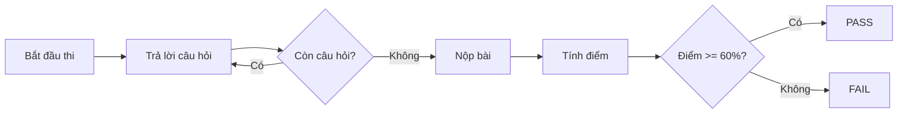
```mermaid
flowchart LR
    A[Bắt đầu thi] --> B[Trả lời câu hỏi]
    B --> C{Còn câu hỏi?}
    C -->|Có| B
    C -->|Không| D[Nộp bài]
    D --> E[Tính điểm]
    E --> F{Điểm >= 60%?}
    F -->|Có| G[PASS]
    F -->|Không| H[FAIL]
```

**Điều kiện Pass/Fail:**
- **Pass**: Đạt từ 60% điểm trở lên
- **Fail**: Dưới 60% điểm

### 2.4. Ràng Buộc Hệ Thống

| Ràng buộc | Mô tả |
|-----------|-------|
| Xác thực | Phải đăng nhập để sử dụng các chức năng |
| Session | Session hết hạn sau 1 giờ không hoạt động |
| Cấp độ | Chỉ xem được nội dung phù hợp với cấp độ |
| Phân quyền | Student không thể truy cập chức năng Teacher |

---

## 3. Kiến Trúc Hệ Thống

### 3.1. Mô Tả Kiến Trúc Tổng Thể

Hệ thống được thiết kế theo **kiến trúc Client-Server** với các đặc điểm:

- **Layered Architecture**: Phân tầng rõ ràng (Presentation, Service, Repository, Data)
- **Protocol-based Communication**: Giao tiếp qua TCP Socket với JSON messages
- **Stateful Server**: Server duy trì trạng thái session và kết nối

### 3.2. Sơ Đồ Kiến Trúc Tổng Thể

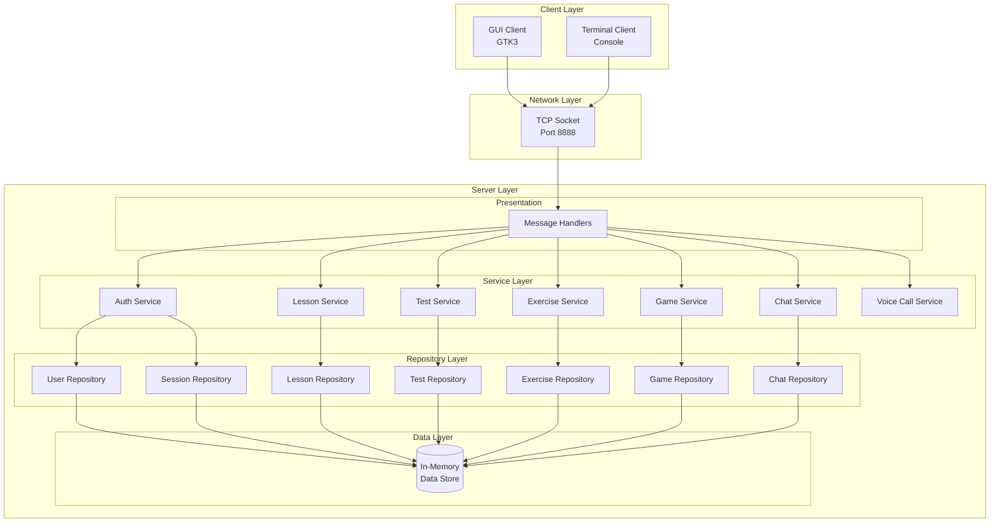
```mermaid
graph TB
    subgraph "Client Layer"
        GUI[GUI Client<br/>GTK3]
        CLI[Terminal Client<br/>Console]
    end

    subgraph "Network Layer"
        TCP[TCP Socket<br/>Port 8888]
    end

    subgraph "Server Layer"
        subgraph "Presentation"
            MH[Message Handlers]
        end

        subgraph "Service Layer"
            AS[Auth Service]
            LS[Lesson Service]
            TS[Test Service]
            ES[Exercise Service]
            GS[Game Service]
            CS[Chat Service]
            VS[Voice Call Service]
        end

        subgraph "Repository Layer"
            UR[User Repository]
            SR[Session Repository]
            LR[Lesson Repository]
            TR[Test Repository]
            ER[Exercise Repository]
            GR[Game Repository]
            CR[Chat Repository]
        end

        subgraph "Data Layer"
            MEM[(In-Memory<br/>Data Store)]
        end
    end

    GUI --> TCP
    CLI --> TCP
    TCP --> MH
    MH --> AS & LS & TS & ES & GS & CS & VS
    AS --> UR & SR
    LS --> LR
    TS --> TR
    ES --> ER
    GS --> GR
    CS --> CR
    UR & SR & LR & TR & ER & GR & CR --> MEM
```

### 3.3. Vai Trò Từng Thành Phần

#### 3.3.1. Client Layer

| Component | Vai trò | Công nghệ |
|-----------|---------|-----------|
| **GUI Client** | Giao diện đồ họa cho người dùng | GTK3, C++ |
| **Terminal Client** | Giao diện dòng lệnh | C++, POSIX |

#### 3.3.2. Server Layer

| Layer | Component | Vai trò |
|-------|-----------|---------|
| **Presentation** | Message Handlers | Parse JSON, routing requests |
| **Service** | Business Services | Xử lý logic nghiệp vụ |
| **Repository** | Data Repositories | Truy xuất và lưu trữ dữ liệu |
| **Data** | In-Memory Store | Lưu trữ dữ liệu tạm thời |

### 3.4. Sơ Đồ Thành Phần Chi Tiết

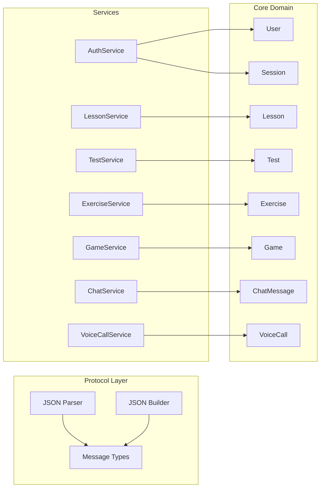
```mermaid
graph LR
    subgraph "Protocol Layer"
        JP[JSON Parser]
        JB[JSON Builder]
        MT[Message Types]
    end

    subgraph "Core Domain"
        User[User]
        Session[Session]
        Lesson[Lesson]
        Test[Test]
        Exercise[Exercise]
        Game[Game]
        Chat[ChatMessage]
        Voice[VoiceCall]
    end

    subgraph "Services"
        Auth[AuthService]
        LessonSvc[LessonService]
        TestSvc[TestService]
        ExerciseSvc[ExerciseService]
        GameSvc[GameService]
        ChatSvc[ChatService]
        VoiceSvc[VoiceCallService]
    end

    JP --> MT
    JB --> MT
    Auth --> User & Session
    LessonSvc --> Lesson
    TestSvc --> Test
    ExerciseSvc --> Exercise
    GameSvc --> Game
    ChatSvc --> Chat
    VoiceSvc --> Voice
```

---

## 4. Chức Năng Của Hệ Thống

### 4.1. Chức Năng Phía Client

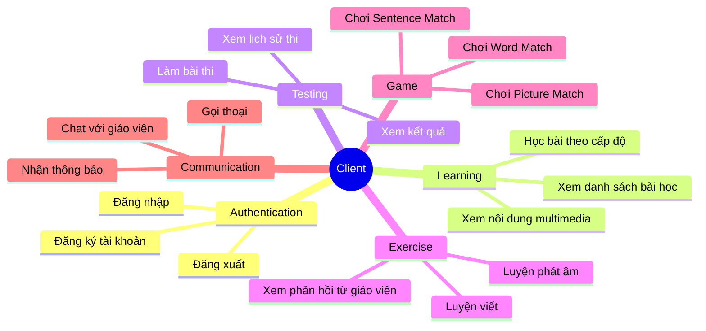
```mermaid
mindmap
  root((Client))
    Authentication
      Đăng ký tài khoản
      Đăng nhập
      Đăng xuất
    Learning
      Xem danh sách bài học
      Học bài theo cấp độ
      Xem nội dung multimedia
    Testing
      Làm bài thi
      Xem kết quả
      Xem lịch sử thi
    Exercise
      Luyện viết
      Luyện phát âm
      Xem phản hồi từ giáo viên
    Game
      Chơi Word Match
      Chơi Picture Match
      Chơi Sentence Match
    Communication
      Chat với giáo viên
      Gọi thoại
      Nhận thông báo
```

### 4.2. Chức Năng Phía Server

| Module | Chức năng | Mô tả |
|--------|-----------|-------|
| **Authentication** | Xác thực người dùng | Register, Login, Session management |
| **Lesson Management** | Quản lý bài học | CRUD lessons, filter by level/topic |
| **Test Management** | Quản lý bài thi | Tạo test, chấm điểm tự động |
| **Exercise Management** | Quản lý bài tập | Submit, review, grading |
| **Game Management** | Quản lý trò chơi | Game sessions, scoring |
| **Chat Service** | Quản lý chat | Real-time messaging, history |
| **Voice Call Service** | Quản lý cuộc gọi | Call signaling, status |

### 4.3. Phân Quyền Người Dùng

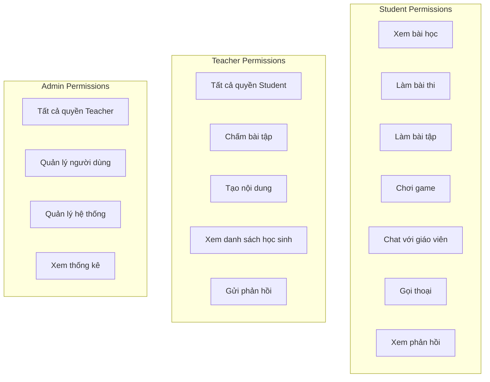
```mermaid
graph TB
    subgraph "Student Permissions"
        S1[Xem bài học]
        S2[Làm bài thi]
        S3[Làm bài tập]
        S4[Chơi game]
        S5[Chat với giáo viên]
        S6[Gọi thoại]
        S7[Xem phản hồi]
    end

    subgraph "Teacher Permissions"
        T1[Tất cả quyền Student]
        T2[Chấm bài tập]
        T3[Tạo nội dung]
        T4[Xem danh sách học sinh]
        T5[Gửi phản hồi]
    end

    subgraph "Admin Permissions"
        A1[Tất cả quyền Teacher]
        A2[Quản lý người dùng]
        A3[Quản lý hệ thống]
        A4[Xem thống kê]
    end
```

**Ma trận phân quyền:**

| Chức năng | Student | Teacher | Admin |
|-----------|:-------:|:-------:|:-----:|
| Đăng ký/Đăng nhập | ✓ | ✓ | ✓ |
| Xem bài học | ✓ | ✓ | ✓ |
| Làm bài thi | ✓ | ✓ | ✓ |
| Làm bài tập | ✓ | ✓ | ✓ |
| Chơi game | ✓ | ✓ | ✓ |
| Chat | ✓ | ✓ | ✓ |
| Voice Call | ✓ | ✓ | ✓ |
| Chấm bài | ✗ | ✓ | ✓ |
| Tạo nội dung | ✗ | ✓ | ✓ |
| Quản lý users | ✗ | ✗ | ✓ |

---

## 5. Use Case

### 5.1. Use Case Diagram

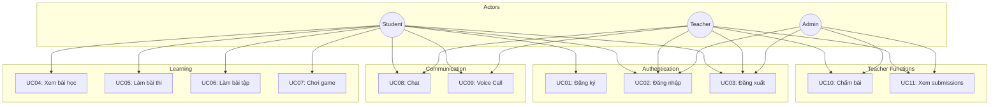
```mermaid
graph TB
    subgraph "Actors"
        ST((Student))
        TE((Teacher))
        AD((Admin))
    end

    subgraph "Authentication"
        UC1[UC01: Đăng ký]
        UC2[UC02: Đăng nhập]
        UC3[UC03: Đăng xuất]
    end

    subgraph "Learning"
        UC4[UC04: Xem bài học]
        UC5[UC05: Làm bài thi]
        UC6[UC06: Làm bài tập]
        UC7[UC07: Chơi game]
    end

    subgraph "Communication"
        UC8[UC08: Chat]
        UC9[UC09: Voice Call]
    end

    subgraph "Teacher Functions"
        UC10[UC10: Chấm bài]
        UC11[UC11: Xem submissions]
    end

    ST --> UC1 & UC2 & UC3
    ST --> UC4 & UC5 & UC6 & UC7
    ST --> UC8 & UC9

    TE --> UC2 & UC3
    TE --> UC8 & UC9
    TE --> UC10 & UC11

    AD --> UC2 & UC3
    AD --> UC10 & UC11
```

### 5.2. Danh Sách Use Case Chính

| ID | Use Case | Actor | Mô tả |
|----|----------|-------|-------|
| UC01 | Đăng ký | Student | Tạo tài khoản mới |
| UC02 | Đăng nhập | All | Xác thực và truy cập hệ thống |
| UC03 | Đăng xuất | All | Kết thúc phiên làm việc |
| UC04 | Xem bài học | Student | Truy cập nội dung học tập |
| UC05 | Làm bài thi | Student | Kiểm tra kiến thức |
| UC06 | Làm bài tập | Student | Luyện tập và nộp bài |
| UC07 | Chơi game | Student | Học qua trò chơi |
| UC08 | Chat | All | Giao tiếp real-time |
| UC09 | Voice Call | All | Gọi thoại |
| UC10 | Chấm bài | Teacher | Đánh giá bài làm học sinh |
| UC11 | Xem submissions | Teacher | Xem danh sách bài nộp |

### 5.3. Mô Tả Chi Tiết Use Case

#### UC02: Đăng nhập

| Thuộc tính | Mô tả |
|------------|-------|
| **Actor** | Student, Teacher, Admin |
| **Precondition** | Đã có tài khoản trong hệ thống |
| **Main Flow** | 1. User nhập email và password<br/>2. Client gửi LOGIN_REQUEST<br/>3. Server xác thực<br/>4. Server trả về session token<br/>5. Client lưu token và chuyển màn hình |
| **Alternative Flow** | 3a. Sai thông tin → Hiển thị lỗi |
| **Postcondition** | User đã đăng nhập, có session token |

#### UC05: Làm bài thi

| Thuộc tính | Mô tả |
|------------|-------|
| **Actor** | Student |
| **Precondition** | Đã đăng nhập, có quyền truy cập cấp độ |
| **Main Flow** | 1. Chọn cấp độ<br/>2. Lấy bài thi từ server<br/>3. Hiển thị câu hỏi<br/>4. User trả lời<br/>5. Nộp bài<br/>6. Server chấm điểm<br/>7. Hiển thị kết quả |
| **Postcondition** | Kết quả được lưu, user biết điểm |

#### UC07: Chơi game Picture Match

| Thuộc tính | Mô tả |
|------------|-------|
| **Actor** | Student |
| **Precondition** | Đã đăng nhập |
| **Main Flow** | 1. Chọn game Picture Match<br/>2. Server gửi dữ liệu game (từ + hình)<br/>3. Hiển thị giao diện với hình ảnh<br/>4. User ghép cặp từ-hình<br/>5. Nộp kết quả<br/>6. Server tính điểm |
| **Postcondition** | Điểm được ghi nhận |

---

## 6. Quy Trình Hoạt Động Của Từng Chức Năng

### 6.1. Quy Trình Đăng Nhập

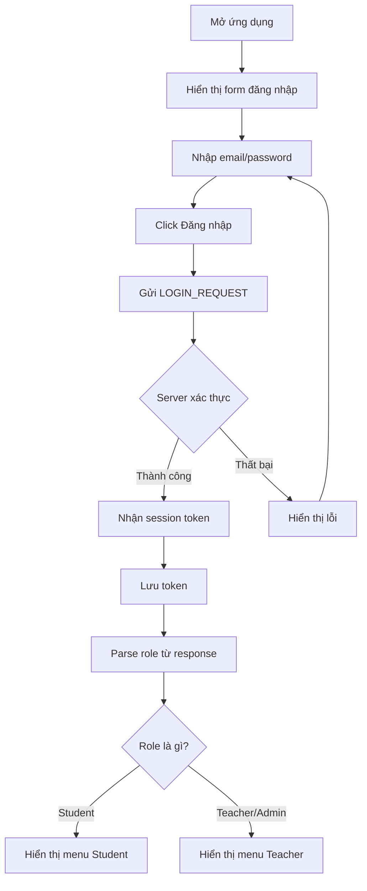
```mermaid
flowchart TD
    A[Mở ứng dụng] --> B[Hiển thị form đăng nhập]
    B --> C[Nhập email/password]
    C --> D[Click Đăng nhập]
    D --> E[Gửi LOGIN_REQUEST]
    E --> F{Server xác thực}
    F -->|Thành công| G[Nhận session token]
    F -->|Thất bại| H[Hiển thị lỗi]
    G --> I[Lưu token]
    I --> J[Parse role từ response]
    J --> K{Role là gì?}
    K -->|Student| L[Hiển thị menu Student]
    K -->|Teacher/Admin| M[Hiển thị menu Teacher]
    H --> C
```

### 6.2. Quy Trình Làm Bài Thi

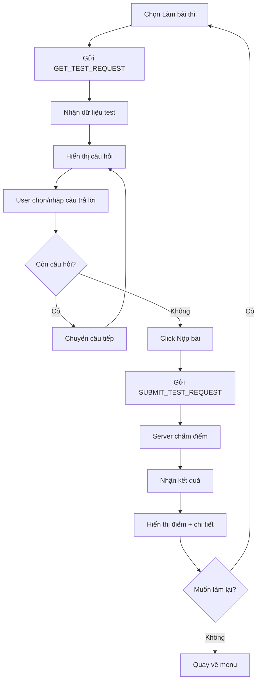
```mermaid
flowchart TD
    A[Chọn Làm bài thi] --> B[Gửi GET_TEST_REQUEST]
    B --> C[Nhận dữ liệu test]
    C --> D[Hiển thị câu hỏi]
    D --> E[User chọn/nhập câu trả lời]
    E --> F{Còn câu hỏi?}
    F -->|Có| G[Chuyển câu tiếp]
    G --> D
    F -->|Không| H[Click Nộp bài]
    H --> I[Gửi SUBMIT_TEST_REQUEST]
    I --> J[Server chấm điểm]
    J --> K[Nhận kết quả]
    K --> L[Hiển thị điểm + chi tiết]
    L --> M{Muốn làm lại?}
    M -->|Có| A
    M -->|Không| N[Quay về menu]
```

### 6.3. Quy Trình Chơi Game

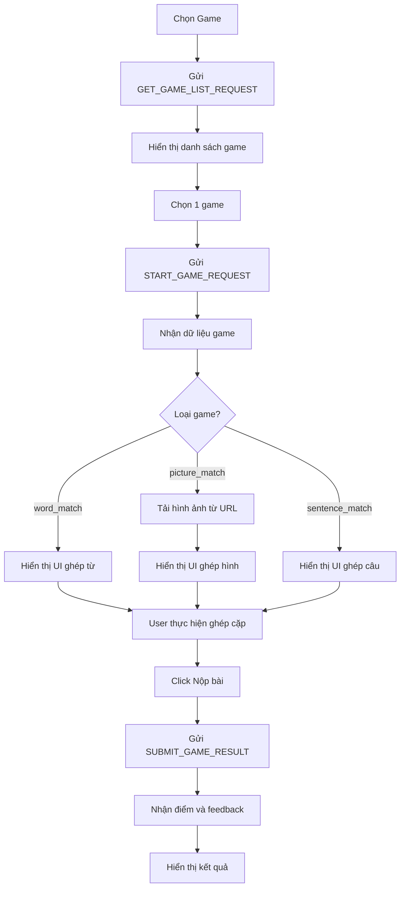
```mermaid
flowchart TD
    A[Chọn Game] --> B[Gửi GET_GAME_LIST_REQUEST]
    B --> C[Hiển thị danh sách game]
    C --> D[Chọn 1 game]
    D --> E[Gửi START_GAME_REQUEST]
    E --> F[Nhận dữ liệu game]
    F --> G{Loại game?}
    G -->|word_match| H[Hiển thị UI ghép từ]
    G -->|picture_match| I[Tải hình ảnh từ URL]
    I --> J[Hiển thị UI ghép hình]
    G -->|sentence_match| K[Hiển thị UI ghép câu]
    H & J & K --> L[User thực hiện ghép cặp]
    L --> M[Click Nộp bài]
    M --> N[Gửi SUBMIT_GAME_RESULT]
    N --> O[Nhận điểm và feedback]
    O --> P[Hiển thị kết quả]
```

### 6.4. Quy Trình Chat

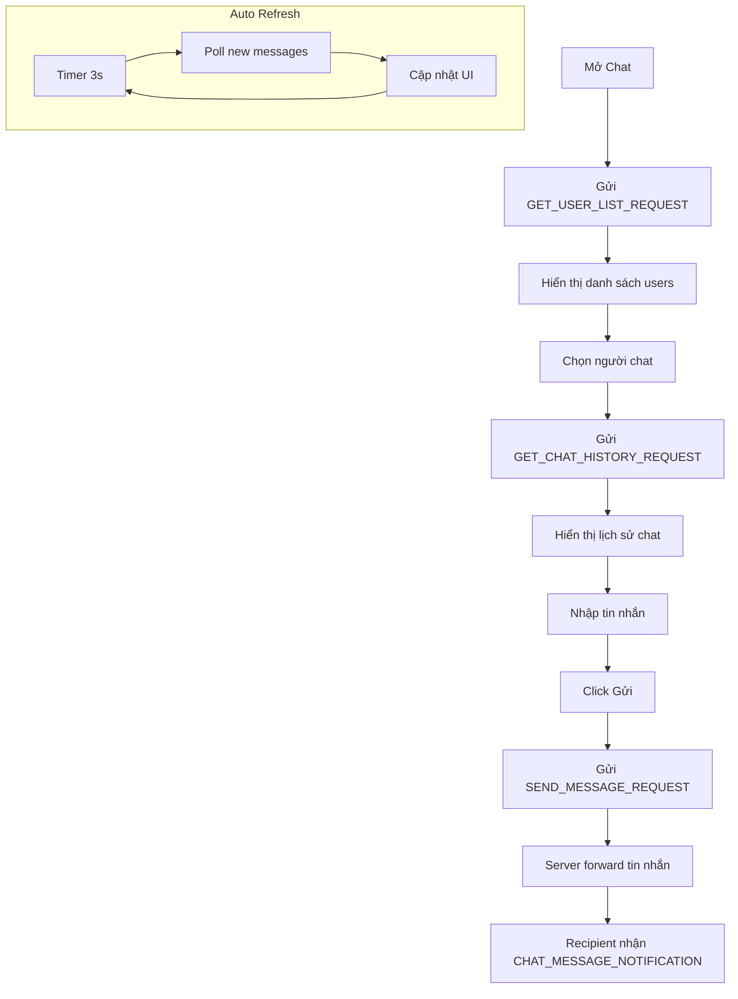
```mermaid
flowchart TD
    A[Mở Chat] --> B[Gửi GET_USER_LIST_REQUEST]
    B --> C[Hiển thị danh sách users]
    C --> D[Chọn người chat]
    D --> E[Gửi GET_CHAT_HISTORY_REQUEST]
    E --> F[Hiển thị lịch sử chat]
    F --> G[Nhập tin nhắn]
    G --> H[Click Gửi]
    H --> I[Gửi SEND_MESSAGE_REQUEST]
    I --> J[Server forward tin nhắn]
    J --> K[Recipient nhận CHAT_MESSAGE_NOTIFICATION]

    subgraph "Auto Refresh"
        L[Timer 3s] --> M[Poll new messages]
        M --> N[Cập nhật UI]
        N --> L
    end
```

### 6.5. Quy Trình Voice Call

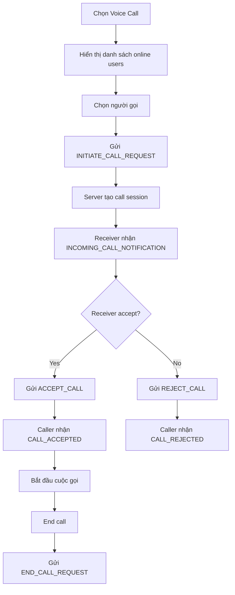
```mermaid
flowchart TD
    A[Chọn Voice Call] --> B[Hiển thị danh sách online users]
    B --> C[Chọn người gọi]
    C --> D[Gửi INITIATE_CALL_REQUEST]
    D --> E[Server tạo call session]
    E --> F[Receiver nhận INCOMING_CALL_NOTIFICATION]
    F --> G{Receiver accept?}
    G -->|Yes| H[Gửi ACCEPT_CALL]
    G -->|No| I[Gửi REJECT_CALL]
    H --> J[Caller nhận CALL_ACCEPTED]
    J --> K[Bắt đầu cuộc gọi]
    I --> L[Caller nhận CALL_REJECTED]
    K --> M[End call]
    M --> N[Gửi END_CALL_REQUEST]
```

---

## 7. Biểu Đồ Trình Tự (Sequence Diagram)

### 7.1. Sequence Diagram: Đăng Nhập

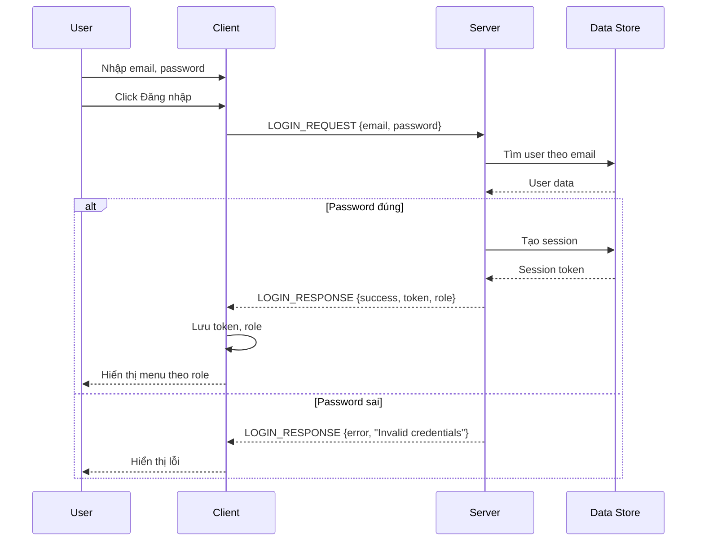
```mermaid
sequenceDiagram
    participant U as User
    participant C as Client
    participant S as Server
    participant DB as Data Store

    U->>C: Nhập email, password
    U->>C: Click Đăng nhập
    C->>S: LOGIN_REQUEST {email, password}
    S->>DB: Tìm user theo email
    DB-->>S: User data

    alt Password đúng
        S->>DB: Tạo session
        DB-->>S: Session token
        S-->>C: LOGIN_RESPONSE {success, token, role}
        C->>C: Lưu token, role
        C-->>U: Hiển thị menu theo role
    else Password sai
        S-->>C: LOGIN_RESPONSE {error, "Invalid credentials"}
        C-->>U: Hiển thị lỗi
    end
```

### 7.2. Sequence Diagram: Làm Bài Thi

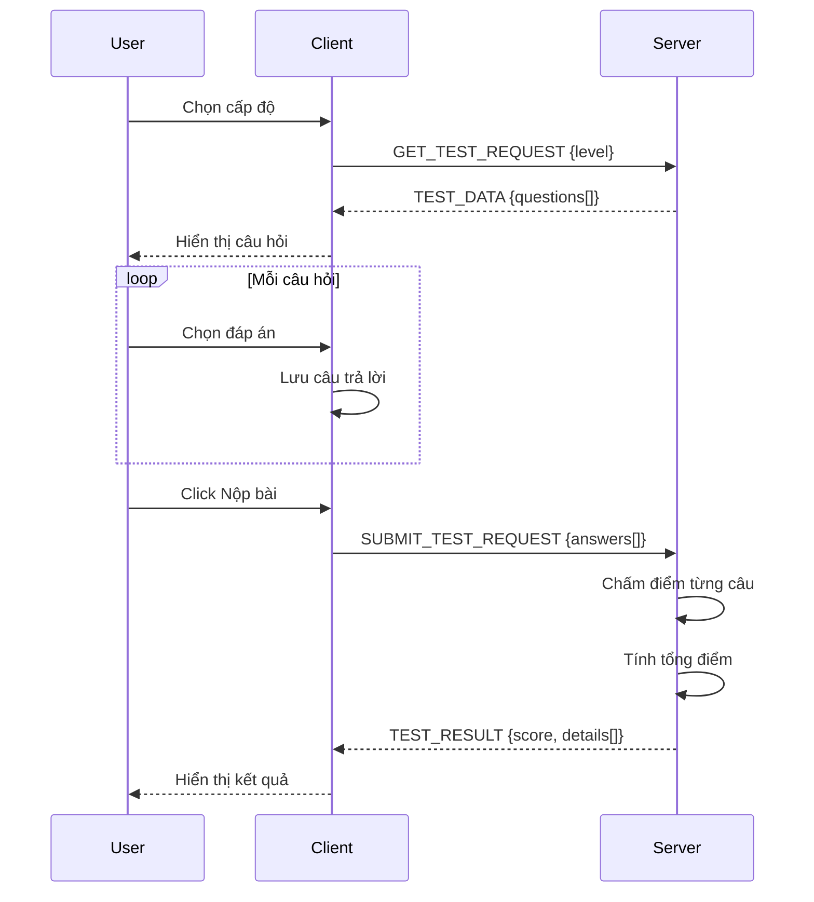
```mermaid
sequenceDiagram
    participant U as User
    participant C as Client
    participant S as Server

    U->>C: Chọn cấp độ
    C->>S: GET_TEST_REQUEST {level}
    S-->>C: TEST_DATA {questions[]}
    C-->>U: Hiển thị câu hỏi

    loop Mỗi câu hỏi
        U->>C: Chọn đáp án
        C->>C: Lưu câu trả lời
    end

    U->>C: Click Nộp bài
    C->>S: SUBMIT_TEST_REQUEST {answers[]}
    S->>S: Chấm điểm từng câu
    S->>S: Tính tổng điểm
    S-->>C: TEST_RESULT {score, details[]}
    C-->>U: Hiển thị kết quả
```

### 7.3. Sequence Diagram: Chat Real-time

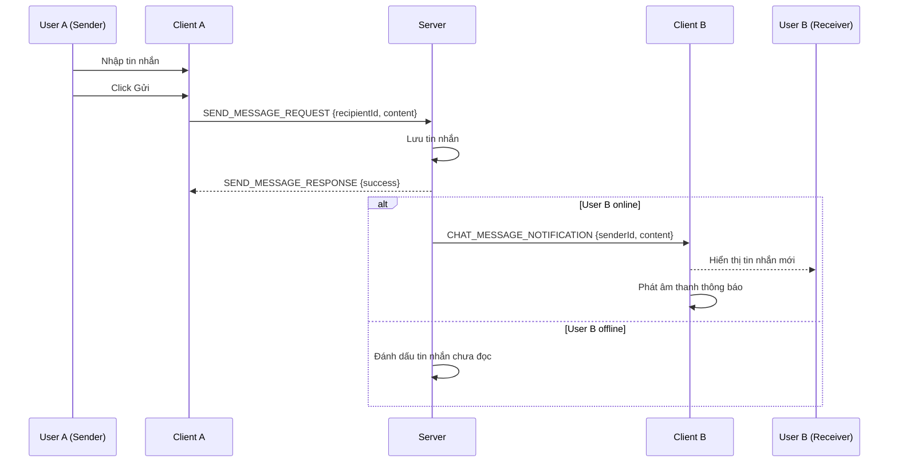
```mermaid
sequenceDiagram
    participant A as User A (Sender)
    participant CA as Client A
    participant S as Server
    participant CB as Client B
    participant B as User B (Receiver)

    A->>CA: Nhập tin nhắn
    A->>CA: Click Gửi
    CA->>S: SEND_MESSAGE_REQUEST {recipientId, content}
    S->>S: Lưu tin nhắn
    S-->>CA: SEND_MESSAGE_RESPONSE {success}

    alt User B online
        S->>CB: CHAT_MESSAGE_NOTIFICATION {senderId, content}
        CB-->>B: Hiển thị tin nhắn mới
        CB->>CB: Phát âm thanh thông báo
    else User B offline
        S->>S: Đánh dấu tin nhắn chưa đọc
    end
```

### 7.4. Sequence Diagram: Voice Call

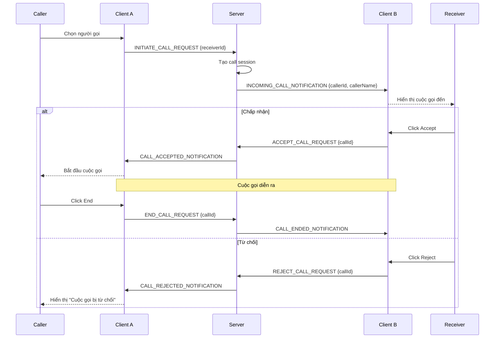
```mermaid
sequenceDiagram
    participant A as Caller
    participant CA as Client A
    participant S as Server
    participant CB as Client B
    participant B as Receiver

    A->>CA: Chọn người gọi
    CA->>S: INITIATE_CALL_REQUEST {receiverId}
    S->>S: Tạo call session
    S->>CB: INCOMING_CALL_NOTIFICATION {callerId, callerName}
    CB-->>B: Hiển thị cuộc gọi đến

    alt Chấp nhận
        B->>CB: Click Accept
        CB->>S: ACCEPT_CALL_REQUEST {callId}
        S->>CA: CALL_ACCEPTED_NOTIFICATION
        CA-->>A: Bắt đầu cuộc gọi
        Note over CA,CB: Cuộc gọi diễn ra
        A->>CA: Click End
        CA->>S: END_CALL_REQUEST {callId}
        S->>CB: CALL_ENDED_NOTIFICATION
    else Từ chối
        B->>CB: Click Reject
        CB->>S: REJECT_CALL_REQUEST {callId}
        S->>CA: CALL_REJECTED_NOTIFICATION
        CA-->>A: Hiển thị "Cuộc gọi bị từ chối"
    end
```

### 7.5. Sequence Diagram: Picture Match Game

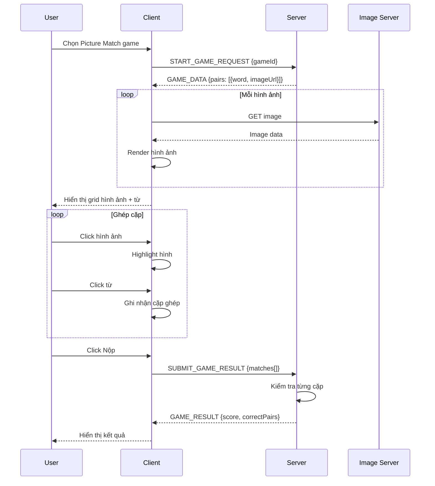
```mermaid
sequenceDiagram
    participant U as User
    participant C as Client
    participant S as Server
    participant URL as Image Server

    U->>C: Chọn Picture Match game
    C->>S: START_GAME_REQUEST {gameId}
    S-->>C: GAME_DATA {pairs: [{word, imageUrl}]}

    loop Mỗi hình ảnh
        C->>URL: GET image
        URL-->>C: Image data
        C->>C: Render hình ảnh
    end

    C-->>U: Hiển thị grid hình ảnh + từ

    loop Ghép cặp
        U->>C: Click hình ảnh
        C->>C: Highlight hình
        U->>C: Click từ
        C->>C: Ghi nhận cặp ghép
    end

    U->>C: Click Nộp
    C->>S: SUBMIT_GAME_RESULT {matches[]}
    S->>S: Kiểm tra từng cặp
    S-->>C: GAME_RESULT {score, correctPairs}
    C-->>U: Hiển thị kết quả
```

---

## 8. Thiết Kế Bản Tin (Message Design)

### 8.1. Tổng Quan Các Loại Bản Tin

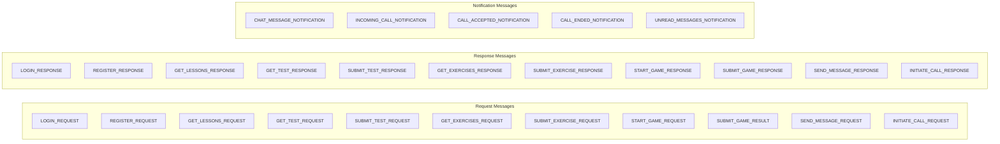
```mermaid
graph LR
    subgraph "Request Messages"
        R1[LOGIN_REQUEST]
        R2[REGISTER_REQUEST]
        R3[GET_LESSONS_REQUEST]
        R4[GET_TEST_REQUEST]
        R5[SUBMIT_TEST_REQUEST]
        R6[GET_EXERCISES_REQUEST]
        R7[SUBMIT_EXERCISE_REQUEST]
        R8[START_GAME_REQUEST]
        R9[SUBMIT_GAME_RESULT]
        R10[SEND_MESSAGE_REQUEST]
        R11[INITIATE_CALL_REQUEST]
    end

    subgraph "Response Messages"
        P1[LOGIN_RESPONSE]
        P2[REGISTER_RESPONSE]
        P3[GET_LESSONS_RESPONSE]
        P4[GET_TEST_RESPONSE]
        P5[SUBMIT_TEST_RESPONSE]
        P6[GET_EXERCISES_RESPONSE]
        P7[SUBMIT_EXERCISE_RESPONSE]
        P8[START_GAME_RESPONSE]
        P9[SUBMIT_GAME_RESPONSE]
        P10[SEND_MESSAGE_RESPONSE]
        P11[INITIATE_CALL_RESPONSE]
    end

    subgraph "Notification Messages"
        N1[CHAT_MESSAGE_NOTIFICATION]
        N2[INCOMING_CALL_NOTIFICATION]
        N3[CALL_ACCEPTED_NOTIFICATION]
        N4[CALL_ENDED_NOTIFICATION]
        N5[UNREAD_MESSAGES_NOTIFICATION]
    end
```

### 8.2. Phân Loại Bản Tin

| Loại | Mô tả | Hướng | Ví dụ |
|------|-------|-------|-------|
| **Request** | Yêu cầu từ Client | Client → Server | LOGIN_REQUEST |
| **Response** | Phản hồi từ Server | Server → Client | LOGIN_RESPONSE |
| **Notification** | Thông báo push | Server → Client | CHAT_MESSAGE_NOTIFICATION |

### 8.3. Chi Tiết Từng Loại Bản Tin

#### 8.3.1. Authentication Messages

| Message Type | Sender | Receiver | Mục đích |
|--------------|--------|----------|----------|
| REGISTER_REQUEST | Client | Server | Đăng ký tài khoản mới |
| REGISTER_RESPONSE | Server | Client | Kết quả đăng ký |
| LOGIN_REQUEST | Client | Server | Xác thực người dùng |
| LOGIN_RESPONSE | Server | Client | Token và thông tin user |

#### 8.3.2. Learning Messages

| Message Type | Sender | Receiver | Mục đích |
|--------------|--------|----------|----------|
| GET_LESSONS_REQUEST | Client | Server | Lấy danh sách bài học |
| GET_LESSONS_RESPONSE | Server | Client | Danh sách bài học |
| GET_LESSON_DETAIL_REQUEST | Client | Server | Lấy chi tiết bài học |
| GET_LESSON_DETAIL_RESPONSE | Server | Client | Nội dung bài học |

#### 8.3.3. Test Messages

| Message Type | Sender | Receiver | Mục đích |
|--------------|--------|----------|----------|
| GET_TEST_REQUEST | Client | Server | Lấy bài thi theo level |
| GET_TEST_RESPONSE | Server | Client | Dữ liệu bài thi |
| SUBMIT_TEST_REQUEST | Client | Server | Nộp bài thi |
| SUBMIT_TEST_RESPONSE | Server | Client | Kết quả chấm điểm |

#### 8.3.4. Game Messages

| Message Type | Sender | Receiver | Mục đích |
|--------------|--------|----------|----------|
| GET_GAME_LIST_REQUEST | Client | Server | Danh sách game |
| START_GAME_REQUEST | Client | Server | Bắt đầu chơi game |
| START_GAME_RESPONSE | Server | Client | Dữ liệu game |
| SUBMIT_GAME_RESULT | Client | Server | Nộp kết quả |

#### 8.3.5. Chat Messages

| Message Type | Sender | Receiver | Mục đích |
|--------------|--------|----------|----------|
| SEND_MESSAGE_REQUEST | Client | Server | Gửi tin nhắn |
| SEND_MESSAGE_RESPONSE | Server | Client | Xác nhận đã gửi |
| CHAT_MESSAGE_NOTIFICATION | Server | Client | Thông báo tin nhắn mới |
| GET_CHAT_HISTORY_REQUEST | Client | Server | Lấy lịch sử chat |

#### 8.3.6. Voice Call Messages

| Message Type | Sender | Receiver | Mục đích |
|--------------|--------|----------|----------|
| INITIATE_CALL_REQUEST | Client | Server | Khởi tạo cuộc gọi |
| INCOMING_CALL_NOTIFICATION | Server | Client | Báo có cuộc gọi đến |
| ACCEPT_CALL_REQUEST | Client | Server | Chấp nhận cuộc gọi |
| REJECT_CALL_REQUEST | Client | Server | Từ chối cuộc gọi |
| END_CALL_REQUEST | Client | Server | Kết thúc cuộc gọi |

---

## 9. Format Của Bản Tin

### 9.1. Định Dạng Tổng Quát

Tất cả bản tin sử dụng **JSON format** với cấu trúc:

```json
{
    "messageType": "MESSAGE_TYPE_NAME",
    "messageId": "unique_id",
    "timestamp": 1704067200000,
    "sessionToken": "token_string",
    "payload": {
        // Dữ liệu cụ thể
    }
}
```

### 9.2. Cấu Trúc Chung

| Trường | Kiểu | Bắt buộc | Mô tả |
|--------|------|----------|-------|
| messageType | string | ✓ | Loại bản tin |
| messageId | string | ✗ | ID duy nhất của message |
| timestamp | int64 | ✗ | Unix timestamp (ms) |
| sessionToken | string | ✗ | Token xác thực |
| payload | object | ✓ | Dữ liệu chi tiết |

### 9.3. Chi Tiết Format Từng Bản Tin

#### 9.3.1. LOGIN_REQUEST

```json
{
    "messageType": "LOGIN_REQUEST",
    "payload": {
        "email": "student@example.com",
        "password": "password123"
    }
}
```

| Trường | Kiểu | Mô tả |
|--------|------|-------|
| email | string | Email đăng nhập |
| password | string | Mật khẩu |

#### 9.3.2. LOGIN_RESPONSE

```json
{
    "messageType": "LOGIN_RESPONSE",
    "messageId": "msg_001",
    "timestamp": 1704067200000,
    "payload": {
        "status": "success",
        "message": "Login successfully",
        "data": {
            "userId": "user_001",
            "fullname": "Nguyen Van A",
            "email": "student@example.com",
            "level": "beginner",
            "role": "student",
            "sessionToken": "abc123xyz",
            "expiresAt": 1704070800000
        }
    }
}
```

#### 9.3.3. REGISTER_REQUEST

```json
{
    "messageType": "REGISTER_REQUEST",
    "payload": {
        "fullname": "Nguyen Van A",
        "email": "newuser@example.com",
        "password": "password123",
        "confirmPassword": "password123"
    }
}
```

#### 9.3.4. GET_TEST_REQUEST / RESPONSE

**Request:**
```json
{
    "messageType": "GET_TEST_REQUEST",
    "sessionToken": "abc123xyz",
    "payload": {
        "level": "beginner"
    }
}
```

**Response:**
```json
{
    "messageType": "GET_TEST_RESPONSE",
    "payload": {
        "status": "success",
        "data": {
            "testId": "test_001",
            "title": "Beginner English Test",
            "questions": [
                {
                    "questionId": "q1",
                    "type": "multiple_choice",
                    "question": "What is 'apple' in Vietnamese?",
                    "points": 10,
                    "options": [
                        {"id": "a", "text": "Quả cam"},
                        {"id": "b", "text": "Quả táo"},
                        {"id": "c", "text": "Quả chuối"},
                        {"id": "d", "text": "Quả nho"}
                    ]
                }
            ]
        }
    }
}
```

#### 9.3.5. START_GAME_RESPONSE (Picture Match)

```json
{
    "messageType": "START_GAME_RESPONSE",
    "payload": {
        "status": "success",
        "data": {
            "gameSessionId": "gs_001",
            "gameId": "game_004",
            "gameType": "picture_match",
            "title": "Fruit Pictures",
            "timeLimit": 120,
            "pairs": [
                {
                    "word": "Apple",
                    "imageUrl": "https://cdn-icons-png.flaticon.com/128/415/415682.png"
                },
                {
                    "word": "Banana",
                    "imageUrl": "https://cdn-icons-png.flaticon.com/128/3143/3143643.png"
                }
            ]
        }
    }
}
```

#### 9.3.6. CHAT_MESSAGE_NOTIFICATION

```json
{
    "messageType": "CHAT_MESSAGE_NOTIFICATION",
    "timestamp": 1704067200000,
    "payload": {
        "senderId": "user_002",
        "senderName": "Teacher A",
        "messageContent": "Hello, how are you?",
        "sentAt": 1704067200000
    }
}
```

#### 9.3.7. INCOMING_CALL_NOTIFICATION

```json
{
    "messageType": "INCOMING_CALL_NOTIFICATION",
    "payload": {
        "callId": "call_001",
        "callerId": "user_002",
        "callerName": "Teacher A",
        "audioSource": "microphone"
    }
}
```

### 9.4. Error Response Format

```json
{
    "messageType": "ERROR_RESPONSE",
    "payload": {
        "status": "error",
        "errorCode": "AUTH_001",
        "message": "Invalid email or password"
    }
}
```

| Error Code | Mô tả |
|------------|-------|
| AUTH_001 | Sai email/password |
| AUTH_002 | Session hết hạn |
| AUTH_003 | Không có quyền truy cập |
| DATA_001 | Không tìm thấy dữ liệu |
| DATA_002 | Dữ liệu không hợp lệ |

---

## 10. Luồng Bản Tin Trong Từng Chức Năng

### 10.1. Luồng Đăng Nhập

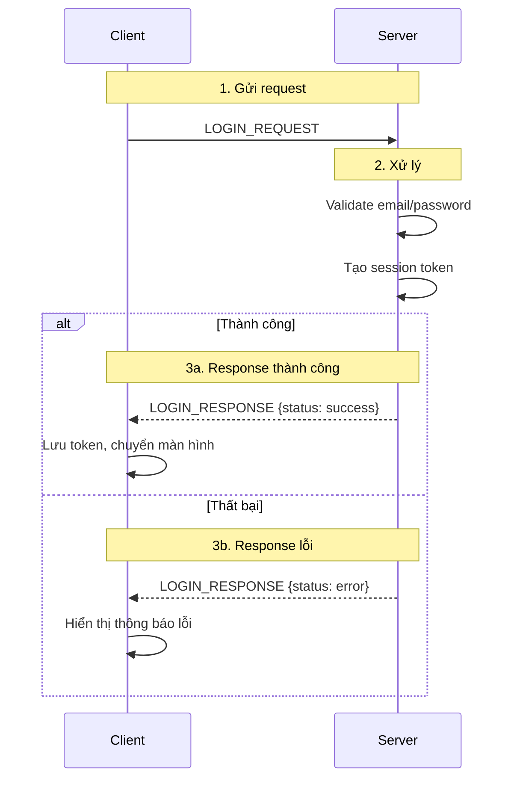
```mermaid
sequenceDiagram
    participant C as Client
    participant S as Server

    Note over C,S: 1. Gửi request
    C->>S: LOGIN_REQUEST

    Note over S: 2. Xử lý
    S->>S: Validate email/password
    S->>S: Tạo session token

    alt Thành công
        Note over C,S: 3a. Response thành công
        S-->>C: LOGIN_RESPONSE {status: success}
        C->>C: Lưu token, chuyển màn hình
    else Thất bại
        Note over C,S: 3b. Response lỗi
        S-->>C: LOGIN_RESPONSE {status: error}
        C->>C: Hiển thị thông báo lỗi
    end
```

### 10.2. Luồng Chat

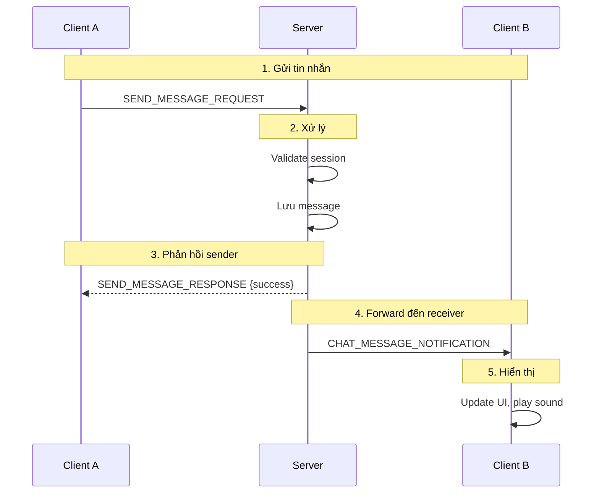
```mermaid
sequenceDiagram
    participant A as Client A
    participant S as Server
    participant B as Client B

    Note over A,B: 1. Gửi tin nhắn
    A->>S: SEND_MESSAGE_REQUEST

    Note over S: 2. Xử lý
    S->>S: Validate session
    S->>S: Lưu message

    Note over A,S: 3. Phản hồi sender
    S-->>A: SEND_MESSAGE_RESPONSE {success}

    Note over S,B: 4. Forward đến receiver
    S->>B: CHAT_MESSAGE_NOTIFICATION

    Note over B: 5. Hiển thị
    B->>B: Update UI, play sound
```

### 10.3. Luồng Voice Call

```mermaid
sequenceDiagram
    participant A as Caller
    participant S as Server
    participant B as Receiver

    Note over A,B: 1. Khởi tạo cuộc gọi
    A->>S: INITIATE_CALL_REQUEST
    S->>S: Tạo call session
    S-->>A: INITIATE_CALL_RESPONSE

    Note over S,B: 2. Thông báo receiver
    S->>B: INCOMING_CALL_NOTIFICATION

    Note over B,S: 3. Receiver phản hồi
    alt Accept
        B->>S: ACCEPT_CALL_REQUEST
        S->>A: CALL_ACCEPTED_NOTIFICATION
        Note over A,B: Cuộc gọi bắt đầu
    else Reject
        B->>S: REJECT_CALL_REQUEST
        S->>A: CALL_REJECTED_NOTIFICATION
    end

    Note over A,B: 4. Kết thúc cuộc gọi
    A->>S: END_CALL_REQUEST
    S->>B: CALL_ENDED_NOTIFICATION
```

### 10.4. Xử Lý Lỗi

| Tình huống | Client xử lý | Server xử lý |
|------------|--------------|--------------|
| Session hết hạn | Chuyển về màn hình login | Trả về AUTH_002 error |
| Network timeout | Retry 3 lần, hiển thị lỗi | Log error |
| Invalid data | Validate trước khi gửi | Reject và trả error |
| User offline | Hiển thị trạng thái offline | Queue notification |

---

## 11. Xử Lý Bản Tin Phía Client / Server

### 11.1. Xử Lý Phía Client

#### 11.1.1. Nhận và Parse Message

```cpp
// Pseudocode
void handleServerMessage(string rawMessage) {
    // 1. Parse JSON
    string messageType = getJsonValue(rawMessage, "messageType");
    string payload = getJsonObject(rawMessage, "payload");

    // 2. Route đến handler phù hợp
    switch(messageType) {
        case "LOGIN_RESPONSE":
            handleLoginResponse(payload);
            break;
        case "CHAT_MESSAGE_NOTIFICATION":
            handleChatNotification(payload);
            break;
        case "INCOMING_CALL_NOTIFICATION":
            handleIncomingCall(payload);
            break;
        // ...
    }
}
```

#### 11.1.2. Xử Lý Response

| Response Type | Xử lý khi Success | Xử lý khi Error |
|--------------|-------------------|-----------------|
| LOGIN_RESPONSE | Lưu token, role; chuyển màn hình | Hiển thị "Sai mật khẩu" |
| SUBMIT_TEST_RESPONSE | Hiển thị điểm, chi tiết | Hiển thị lỗi, cho làm lại |
| SEND_MESSAGE_RESPONSE | Đánh dấu đã gửi | Retry hoặc báo lỗi |

#### 11.1.3. Xử Lý Notification

```mermaid
flowchart TD
    A[Nhận Notification] --> B{Loại notification?}
    B -->|CHAT_MESSAGE| C[Cập nhật chat UI]
    C --> D[Phát âm thanh]
    D --> E[Hiển thị popup]

    B -->|INCOMING_CALL| F[Hiển thị dialog cuộc gọi]
    F --> G[Chờ user response]

    B -->|UNREAD_MESSAGES| H[Cập nhật badge count]
```

### 11.2. Xử Lý Phía Server

#### 11.2.1. Message Handler Architecture

```mermaid
flowchart TD
    A[Nhận raw message] --> B[Parse JSON]
    B --> C[Extract messageType]
    C --> D{Route to handler}
    D -->|LOGIN| E[handleLogin]
    D -->|REGISTER| F[handleRegister]
    D -->|GET_LESSONS| G[handleGetLessons]
    D -->|SEND_MESSAGE| H[handleSendMessage]
    D -->|INITIATE_CALL| I[handleInitiateCall]

    E & F & G & H & I --> J[Build response]
    J --> K[Send to client]
```

#### 11.2.2. Xử Lý Request

```cpp
// Pseudocode
string handleLogin(string json, int clientSocket) {
    // 1. Parse payload
    string email = getJsonValue(payload, "email");
    string password = getJsonValue(payload, "password");

    // 2. Validate
    User* user = findUserByEmail(email);
    if (!user || user->password != password) {
        return buildErrorResponse("Invalid credentials");
    }

    // 3. Create session
    string token = generateSessionToken();
    createSession(token, user->userId);

    // 4. Build response
    return buildLoginResponse(user, token);
}
```

#### 11.2.3. Forward Notification

```cpp
// Pseudocode - Chat message
void forwardChatMessage(string senderId, string recipientId, string content) {
    // 1. Tìm socket của recipient
    int recipientSocket = getSocketByUserId(recipientId);

    if (recipientSocket > 0) {
        // 2. Online: gửi ngay
        string notification = buildChatNotification(senderId, content);
        sendMessage(recipientSocket, notification);
    } else {
        // 3. Offline: lưu vào queue
        queueOfflineMessage(recipientId, senderId, content);
    }
}
```

### 11.3. Kiểm Tra Lỗi và Bảo Mật

#### 11.3.1. Validation Rules

| Kiểm tra | Client | Server |
|----------|--------|--------|
| Email format | ✓ | ✓ |
| Password length | ✓ | ✓ |
| Session token | N/A | ✓ |
| User permissions | N/A | ✓ |
| Rate limiting | N/A | ✓ |

#### 11.3.2. Security Measures

```mermaid
flowchart TD
    A[Request đến] --> B{Có session token?}
    B -->|Không| C{Public endpoint?}
    C -->|Có| D[Xử lý request]
    C -->|Không| E[Reject: AUTH_002]

    B -->|Có| F{Token hợp lệ?}
    F -->|Không| G[Reject: AUTH_002]
    F -->|Có| H{Token hết hạn?}
    H -->|Có| G
    H -->|Không| I{Có quyền?}
    I -->|Không| J[Reject: AUTH_003]
    I -->|Có| D
```

#### 11.3.3. Error Handling

| Layer | Xử lý lỗi |
|-------|-----------|
| Network | Timeout, retry, reconnect |
| Protocol | JSON parse error, invalid message type |
| Business | Validation failed, resource not found |
| Security | Auth failed, permission denied |

---

## 12. Đánh Giá Ứng Dụng

### 12.1. Ưu Điểm

#### 12.1.1. Kiến Trúc

| Ưu điểm | Mô tả |
|---------|-------|
| **Layered Architecture** | Phân tầng rõ ràng, dễ bảo trì |
| **Protocol-based** | Giao thức JSON linh hoạt, dễ debug |
| **Modular Design** | Các module độc lập, dễ mở rộng |
| **Service Layer** | Business logic tách biệt, dễ test |

#### 12.1.2. Chức Năng

| Ưu điểm | Mô tả |
|---------|-------|
| **Đa dạng** | Nhiều hình thức học tập |
| **Real-time** | Chat và Voice Call real-time |
| **Phân quyền** | Hệ thống role rõ ràng |
| **Multimedia** | Hỗ trợ hình ảnh, audio |

#### 12.1.3. Kỹ thuật

| Ưu điểm | Mô tả |
|---------|-------|
| **Cross-platform** | Chạy được trên Linux/Windows |
| **GUI đẹp** | Giao diện GTK3 thân thiện |
| **Lightweight** | Không cần database server riêng |

### 12.2. Nhược Điểm

#### 12.2.1. Hạn Chế Kỹ Thuật

| Nhược điểm | Mô tả | Giải pháp đề xuất |
|------------|-------|-------------------|
| **In-memory storage** | Dữ liệu mất khi restart server | Tích hợp SQLite/PostgreSQL |
| **Single server** | Không scale được | Implement load balancer |
| **No encryption** | Dữ liệu truyền plaintext | Thêm TLS/SSL |
| **Blocking I/O** | Có thể bottleneck | Chuyển sang async I/O |

#### 12.2.2. Hạn Chế Chức Năng

| Nhược điểm | Mô tả |
|------------|-------|
| Voice Call chưa có audio thực | Chỉ có signaling |
| Không có video call | Chưa implement |
| Không có mobile app | Chỉ có desktop |

### 12.3. Khả Năng Mở Rộng

```mermaid
graph TB
    subgraph "Hiện tại"
        A[Single Server]
        B[In-Memory Data]
        C[Desktop Client]
    end

    subgraph "Mở rộng gần"
        D[Database Integration]
        E[File Storage]
        F[Web Client]
    end

    subgraph "Mở rộng xa"
        G[Microservices]
        H[Cloud Deployment]
        I[Mobile Apps]
        J[AI Integration]
    end

    A --> D
    B --> D
    C --> F
    D --> G
    F --> I
    G --> H
    H --> J
```

### 12.4. Hướng Phát Triển Trong Tương Lai

#### 12.4.1. Ngắn Hạn (1-3 tháng)

| Tính năng | Mô tả | Độ ưu tiên |
|-----------|-------|------------|
| Database Integration | SQLite/PostgreSQL | Cao |
| SSL/TLS | Mã hóa giao tiếp | Cao |
| Password Hashing | Bảo mật mật khẩu | Cao |
| Web Client | React/Vue frontend | Trung bình |

#### 12.4.2. Trung Hạn (3-6 tháng)

| Tính năng | Mô tả |
|-----------|-------|
| Real Audio/Video Call | WebRTC integration |
| Mobile App | React Native/Flutter |
| Admin Dashboard | Quản lý nội dung, users |
| Analytics | Thống kê học tập |

#### 12.4.3. Dài Hạn (6-12 tháng)

| Tính năng | Mô tả |
|-----------|-------|
| AI Tutor | Chatbot hỗ trợ học tập |
| Speech Recognition | Chấm điểm phát âm tự động |
| Adaptive Learning | Cá nhân hóa lộ trình học |
| Gamification | Hệ thống điểm, achievements |
| Social Features | Bạn bè, nhóm học tập |

### 12.5. Kết Luận

**English Learning Application** là một hệ thống học tiếng Anh hoàn chỉnh với kiến trúc Client-Server vững chắc. Ứng dụng cung cấp đầy đủ các tính năng cần thiết cho việc học tập:

- ✅ Hệ thống bài học phân cấp
- ✅ Bài thi với chấm điểm tự động
- ✅ Bài tập với phản hồi từ giáo viên
- ✅ Game học tập tương tác
- ✅ Chat real-time
- ✅ Voice Call

Với thiết kế module và protocol rõ ràng, ứng dụng có thể dễ dàng mở rộng và cải tiến trong tương lai để đáp ứng nhu cầu ngày càng cao của người dùng.

---

## Phụ Lục

### A. Danh Sách Message Types

```
// Authentication
REGISTER_REQUEST, REGISTER_RESPONSE
LOGIN_REQUEST, LOGIN_RESPONSE

// Lessons
GET_LESSONS_REQUEST, GET_LESSONS_RESPONSE
GET_LESSON_DETAIL_REQUEST, GET_LESSON_DETAIL_RESPONSE

// Tests
GET_TEST_REQUEST, GET_TEST_RESPONSE
SUBMIT_TEST_REQUEST, SUBMIT_TEST_RESPONSE

// Exercises
GET_EXERCISES_REQUEST, GET_EXERCISES_RESPONSE
GET_EXERCISE_DETAIL_REQUEST, GET_EXERCISE_DETAIL_RESPONSE
SUBMIT_EXERCISE_REQUEST, SUBMIT_EXERCISE_RESPONSE
GET_PENDING_SUBMISSIONS_REQUEST, GET_PENDING_SUBMISSIONS_RESPONSE
GRADE_SUBMISSION_REQUEST, GRADE_SUBMISSION_RESPONSE

// Games
GET_GAME_LIST_REQUEST, GET_GAME_LIST_RESPONSE
START_GAME_REQUEST, START_GAME_RESPONSE
SUBMIT_GAME_RESULT_REQUEST, SUBMIT_GAME_RESULT_RESPONSE

// Chat
GET_USER_LIST_REQUEST, GET_USER_LIST_RESPONSE
SEND_MESSAGE_REQUEST, SEND_MESSAGE_RESPONSE
GET_CHAT_HISTORY_REQUEST, GET_CHAT_HISTORY_RESPONSE
CHAT_MESSAGE_NOTIFICATION
UNREAD_MESSAGES_NOTIFICATION

// Voice Call
INITIATE_CALL_REQUEST, INITIATE_CALL_RESPONSE
ACCEPT_CALL_REQUEST, ACCEPT_CALL_RESPONSE
REJECT_CALL_REQUEST, REJECT_CALL_RESPONSE
END_CALL_REQUEST, END_CALL_RESPONSE
INCOMING_CALL_NOTIFICATION
CALL_ACCEPTED_NOTIFICATION
CALL_REJECTED_NOTIFICATION
CALL_ENDED_NOTIFICATION
```

### B. Công Nghệ Sử Dụng

| Thành phần | Công nghệ |
|------------|-----------|
| Ngôn ngữ | C++17 |
| GUI Framework | GTK3 |
| Network | POSIX Sockets |
| Threading | std::thread, pthread |
| JSON Parsing | Custom parser |
| Image Loading | GdkPixbuf, curl |
| Build System | Make |

### C. Cấu Trúc Thư Mục

```
EnglishLearning/
├── include/
│   ├── core/           # Domain models
│   ├── protocol/       # Message types, JSON parser
│   ├── repository/     # Data access interfaces
│   └── service/        # Business logic interfaces
├── src/
│   ├── protocol/       # JSON parser implementation
│   ├── repository/     # Repository implementations
│   └── service/        # Service implementations
├── doc/                # Documentation
├── server.cpp          # Server entry point
├── client.cpp          # Terminal client
├── gui_main.cpp        # GUI client
├── client_bridge.h     # Shared client code
└── Makefile            # Build configuration
```

---

> **Tài liệu được tạo tự động từ source code**
> © 2026 English Learning Application Team
